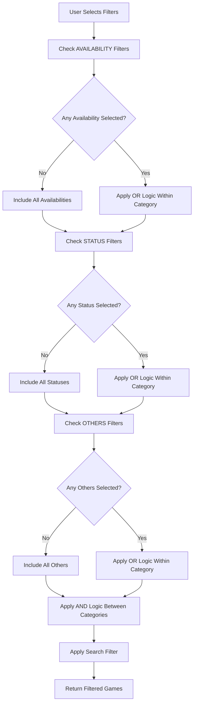
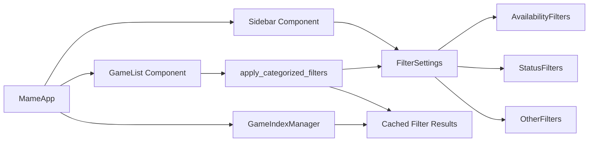
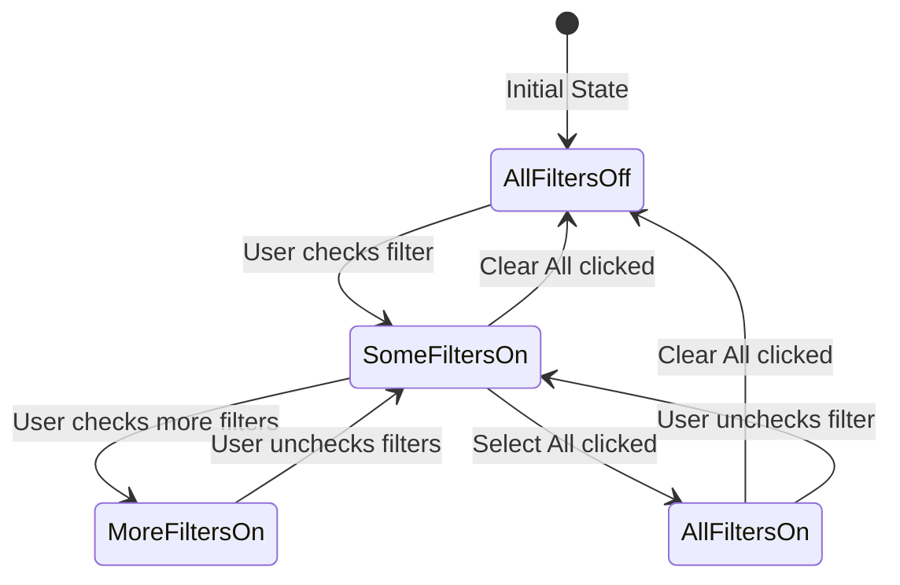

# MAMEUIX Categorized Filter System Design

## Overview
This document outlines the design for a new categorized filter system for MAMEUIX that replaces the current single-selection radio button filters with a multi-selection checkbox system organized into three main categories.

## 1. UI/UX Design

### 1.1 Visual Layout

```
┌─────────────────────────────┐
│ Filters                     │
├─────────────────────────────┤
│ Search: [_______________] 🔍│
├─────────────────────────────┤
│ [Clear All] [Select All]    │
├─────────────────────────────┤
│ 📋 AVAILABILITY             │
│ ☐ Available                 │
│ ☐ Unavailable               │
├─────────────────────────────┤
│ ⚙️ STATUS                   │
│ ☐ Working                   │
│ ☐ Not Working               │
├─────────────────────────────┤
│ 📁 OTHERS                   │
│ ☐ Favorites                 │
│ ☐ Parent ROMs               │
│ ☐ CHD Games                 │
├─────────────────────────────┤
│ Active Filters: 3           │
│ Games shown: 1,234 of 48,000│
└─────────────────────────────┘
```

### 1.2 Interaction Design

1. **Checkbox Behavior**
   - Each filter option has an independent checkbox
   - Clicking toggles the individual filter on/off
   - Visual feedback: checked = active filter, unchecked = inactive

2. **Quick Actions**
   - "Clear All" button: Unchecks all filters (shows all games)
   - "Select All" button: Checks all filters (might show no games due to AND logic)
   - These buttons are placed prominently at the top

3. **Filter Logic Display**
   - Show active filter count
   - Display filtered game count vs total
   - Visual indicators for AND/OR logic between categories

4. **Visual Enhancements**
   - Category headers with icons and colors (already implemented)
   - Hover effects on checkboxes
   - Smooth transitions when filters change
   - Loading indicator during filtering

## 2. Data Model Changes

### 2.1 Current Model (Single Selection)
```rust
pub struct FilterSettings {
    pub search_text: String,
    pub category: Option<FilterCategory>, // Single selection
    // ... other fields
}

pub enum FilterCategory {
    All,
    Available,
    Missing,
    Unavailable,
    // ... etc
}
```

### 2.2 New Model (Multi-Selection)
```rust
pub struct FilterSettings {
    pub search_text: String,
    pub search_mode: SearchMode,
    
    // New multi-selection filter fields
    pub availability_filters: AvailabilityFilters,
    pub status_filters: StatusFilters,
    pub other_filters: OtherFilters,
    
    // Existing fields remain
    pub catver_category: Option<String>,
    pub year_from: String,
    pub year_to: String,
    // ... etc
}

#[derive(Clone, Debug, Serialize, Deserialize)]
pub struct AvailabilityFilters {
    pub show_available: bool,
    pub show_unavailable: bool,
}

#[derive(Clone, Debug, Serialize, Deserialize)]
pub struct StatusFilters {
    pub show_working: bool,
    pub show_not_working: bool,
}

#[derive(Clone, Debug, Serialize, Deserialize)]
pub struct OtherFilters {
    pub show_favorites: bool,
    pub show_parents_only: bool,
    pub show_chd_games: bool,
}

impl Default for AvailabilityFilters {
    fn default() -> Self {
        Self {
            show_available: true,
            show_unavailable: true,
        }
    }
}

impl Default for StatusFilters {
    fn default() -> Self {
        Self {
            show_working: true,
            show_not_working: true,
        }
    }
}

impl Default for OtherFilters {
    fn default() -> Self {
        Self {
            show_favorites: false,
            show_parents_only: false,
            show_chd_games: false,
        }
    }
}
```

## 3. Filter Logic Architecture

### 3.1 Filter Logic Rules

The filtering system uses the following logic:
- **Within a category**: OR logic (e.g., show games that are Available OR Unavailable)
- **Between categories**: AND logic (e.g., show games that match Availability AND Status AND Others)
- **Empty category**: If no filters are selected in a category, it's treated as "show all" for that category

### 3.2 Filter Implementation

```rust
impl GameList {
    fn apply_categorized_filters(
        &self,
        games: &[Game],
        filters: &FilterSettings,
        favorites: &HashSet<String>,
    ) -> Vec<usize> {
        games.iter()
            .enumerate()
            .filter(|(_, game)| {
                // AVAILABILITY check (OR within category)
                let availability_match = {
                    let avail = &filters.availability_filters;
                    // If no filters selected, show all
                    if !avail.show_available && !avail.show_unavailable {
                        true
                    } else {
                        (avail.show_available && matches!(game.status, RomStatus::Available)) ||
                        (avail.show_unavailable && !matches!(game.status, RomStatus::Available))
                    }
                };

                // STATUS check (OR within category)
                let status_match = {
                    let status = &filters.status_filters;
                    // If no filters selected, show all
                    if !status.show_working && !status.show_not_working {
                        true
                    } else {
                        (status.show_working && game.is_working()) ||
                        (status.show_not_working && !game.is_working())
                    }
                };

                // OTHERS check (OR within category)
                let others_match = {
                    let others = &filters.other_filters;
                    // If no filters selected, show all
                    if !others.show_favorites && !others.show_parents_only && !others.show_chd_games {
                        true
                    } else {
                        (others.show_favorites && favorites.contains(&game.name)) ||
                        (others.show_parents_only && !game.is_clone) ||
                        (others.show_chd_games && game.requires_chd)
                    }
                };

                // AND logic between categories
                availability_match && status_match && others_match
            })
            .map(|(idx, _)| idx)
            .collect()
    }
}
```

### 3.3 Game Helper Methods

```rust
impl Game {
    pub fn is_working(&self) -> bool {
        // Working includes both "good" and "imperfect" driver status
        matches!(self.driver_status.as_str(), "good" | "imperfect")
    }
    
    pub fn is_available(&self) -> bool {
        matches!(self.status, RomStatus::Available)
    }
}
```

## 4. UI Implementation Changes

### 4.1 Sidebar Filter UI

```rust
impl Sidebar {
    pub fn show_categorized_filters(
        &mut self,
        ui: &mut egui::Ui,
        filter_settings: &mut FilterSettings,
    ) {
        ui.heading("Filters");
        ui.separator();
        
        // Quick action buttons
        ui.horizontal(|ui| {
            if ui.button("Clear All").clicked() {
                self.clear_all_filters(filter_settings);
            }
            if ui.button("Select All").clicked() {
                self.select_all_filters(filter_settings);
            }
        });
        
        ui.separator();
        
        // AVAILABILITY section
        ui.label(egui::RichText::new("📋 AVAILABILITY")
            .heading()
            .color(egui::Color32::from_rgb(100, 150, 255)));
        
        ui.checkbox(
            &mut filter_settings.availability_filters.show_available,
            "Available"
        );
        ui.checkbox(
            &mut filter_settings.availability_filters.show_unavailable,
            "Unavailable"
        );
        
        ui.separator();
        
        // STATUS section
        ui.label(egui::RichText::new("⚙️ STATUS")
            .heading()
            .color(egui::Color32::from_rgb(255, 150, 100)));
        
        ui.checkbox(
            &mut filter_settings.status_filters.show_working,
            "Working"
        );
        ui.checkbox(
            &mut filter_settings.status_filters.show_not_working,
            "Not Working"
        );
        
        ui.separator();
        
        // OTHERS section
        ui.label(egui::RichText::new("📁 OTHERS")
            .heading()
            .color(egui::Color32::from_rgb(150, 255, 100)));
        
        ui.checkbox(
            &mut filter_settings.other_filters.show_favorites,
            "Favorites"
        );
        ui.checkbox(
            &mut filter_settings.other_filters.show_parents_only,
            "Parent ROMs (no duplicates)"
        );
        ui.checkbox(
            &mut filter_settings.other_filters.show_chd_games,
            "CHD Games"
        );
        
        ui.separator();
        
        // Filter status
        let active_count = self.count_active_filters(filter_settings);
        ui.label(format!("Active Filters: {}", active_count));
    }
    
    fn clear_all_filters(&self, filters: &mut FilterSettings) {
        filters.availability_filters = AvailabilityFilters::default();
        filters.status_filters = StatusFilters::default();
        filters.other_filters = OtherFilters::default();
    }
    
    fn select_all_filters(&self, filters: &mut FilterSettings) {
        filters.availability_filters.show_available = true;
        filters.availability_filters.show_unavailable = true;
        filters.status_filters.show_working = true;
        filters.status_filters.show_not_working = true;
        filters.other_filters.show_favorites = true;
        filters.other_filters.show_parents_only = true;
        filters.other_filters.show_chd_games = true;
    }
    
    fn count_active_filters(&self, filters: &FilterSettings) -> usize {
        let mut count = 0;
        
        if filters.availability_filters.show_available { count += 1; }
        if filters.availability_filters.show_unavailable { count += 1; }
        if filters.status_filters.show_working { count += 1; }
        if filters.status_filters.show_not_working { count += 1; }
        if filters.other_filters.show_favorites { count += 1; }
        if filters.other_filters.show_parents_only { count += 1; }
        if filters.other_filters.show_chd_games { count += 1; }
        
        count
    }
}
```

## 5. Migration Strategy

### 5.1 Configuration Migration

1. **Backward Compatibility**
   - When loading old config with single FilterCategory, map to new multi-selection:
     - `FilterCategory::All` → All filters enabled
     - `FilterCategory::Available` → Only `show_available = true`
     - `FilterCategory::Favorites` → Only `show_favorites = true`
     - etc.

2. **Migration Code**
```rust
impl FilterSettings {
    pub fn migrate_from_legacy(&mut self) {
        if let Some(category) = &self.category {
            match category {
                FilterCategory::All => {
                    // Enable all availability and status filters
                    self.availability_filters = AvailabilityFilters {
                        show_available: true,
                        show_unavailable: true,
                    };
                    self.status_filters = StatusFilters {
                        show_working: true,
                        show_not_working: true,
                    };
                }
                FilterCategory::Available => {
                    self.availability_filters.show_available = true;
                    self.availability_filters.show_unavailable = false;
                }
                FilterCategory::Favorites => {
                    self.other_filters.show_favorites = true;
                }
                // ... handle other cases
            }
            
            // Clear the old category field
            self.category = None;
        }
    }
}
```

### 5.2 User Experience During Migration

1. **First Launch After Update**
   - Show a brief tooltip/notification explaining the new filter system
   - Default to showing all games (all availability/status filters on)
   - Preserve any existing favorite selections

2. **Performance Considerations**
   - Cache filter results to avoid recalculating on every frame
   - Use the existing GameIndexManager for efficient filtering
   - Debounce filter changes to avoid excessive updates

## 6. Testing Strategy

### 6.1 Test Scenarios

1. **Filter Combinations**
   - Test all possible filter combinations
   - Verify AND/OR logic works correctly
   - Ensure "no results" state is handled gracefully

2. **Performance Tests**
   - Filter 48,000+ games with various combinations
   - Measure response time for filter changes
   - Verify no UI lag during filtering

3. **Migration Tests**
   - Test loading old config files
   - Verify correct mapping of old filters to new system
   - Ensure no data loss during migration

### 6.2 Edge Cases

1. **No Filters Selected**
   - Should show all games
   - Clear All button should result in this state

2. **All Filters Selected**
   - Might show no games (due to conflicting criteria)
   - UI should clearly indicate why no games are shown

3. **Search + Filters**
   - Search should work in conjunction with filters
   - Both should use AND logic

## 7. Future Enhancements

1. **Filter Presets**
   - Save common filter combinations
   - Quick access to user-defined presets

2. **Filter Statistics**
   - Show count next to each filter option
   - e.g., "Available (35,421)"

3. **Advanced Filter Logic**
   - Allow users to switch between AND/OR logic
   - Custom filter expressions

4. **Filter Persistence**
   - Remember last used filters between sessions
   - Per-category filter memory

## 8. Implementation Timeline

1. **Phase 1**: Data model changes and migration logic
2. **Phase 2**: UI implementation with checkboxes
3. **Phase 3**: Filter logic implementation
4. **Phase 4**: Testing and optimization
5. **Phase 5**: Documentation and release

This design provides a flexible, intuitive filter system that allows users to quickly find the games they want while maintaining excellent performance even with large game collections.

## 9. Visual Diagrams

### 9.1 Filter Logic Flow



### 9.2 Component Architecture



### 9.3 State Transition Diagram



## 10. Performance Optimizations

### 10.1 Caching Strategy

```rust
pub struct FilterCache {
    // Cache key is a hash of all active filters
    cache: HashMap<u64, Vec<usize>>,
    last_update: Instant,
    max_cache_size: usize,
}

impl FilterCache {
    pub fn get_or_compute(
        &mut self,
        filters: &FilterSettings,
        compute_fn: impl FnOnce() -> Vec<usize>,
    ) -> &Vec<usize> {
        let cache_key = self.compute_filter_hash(filters);
        
        self.cache.entry(cache_key).or_insert_with(|| {
            // Clean old entries if cache is too large
            if self.cache.len() > self.max_cache_size {
                self.clean_oldest_entries();
            }
            compute_fn()
        })
    }
    
    fn compute_filter_hash(&self, filters: &FilterSettings) -> u64 {
        use std::hash::{Hash, Hasher};
        let mut hasher = std::collections::hash_map::DefaultHasher::new();
        
        // Hash all filter states
        filters.availability_filters.show_available.hash(&mut hasher);
        filters.availability_filters.show_unavailable.hash(&mut hasher);
        filters.status_filters.show_working.hash(&mut hasher);
        filters.status_filters.show_not_working.hash(&mut hasher);
        filters.other_filters.show_favorites.hash(&mut hasher);
        filters.other_filters.show_parents_only.hash(&mut hasher);
        filters.other_filters.show_chd_games.hash(&mut hasher);
        
        hasher.finish()
    }
}
```

### 10.2 Parallel Filtering for Large Collections

```rust
use rayon::prelude::*;

impl GameList {
    fn apply_categorized_filters_parallel(
        &self,
        games: &[Game],
        filters: &FilterSettings,
        favorites: &HashSet<String>,
    ) -> Vec<usize> {
        // Use parallel iterator for collections > 10,000 games
        if games.len() > 10_000 {
            games.par_iter()
                .enumerate()
                .filter(|(_, game)| self.matches_all_filters(game, filters, favorites))
                .map(|(idx, _)| idx)
                .collect()
        } else {
            // Use sequential for smaller collections
            self.apply_categorized_filters(games, filters, favorites)
        }
    }
}
```

## 11. Accessibility Considerations

### 11.1 Keyboard Navigation

- Tab order: Search → Clear All → Select All → Category checkboxes in order
- Space/Enter to toggle checkboxes
- Escape to clear search
- Ctrl+A to select all filters
- Ctrl+Shift+A to clear all filters

### 11.2 Screen Reader Support

```rust
ui.checkbox(&mut filter.show_available, "Available")
    .on_hover_text("Show games with all required ROM files present");
    
ui.checkbox(&mut filter.show_working, "Working")
    .on_hover_text("Show games that are playable (includes both perfect and imperfect emulation)");
```

### 11.3 Visual Indicators

- High contrast mode support
- Clear visual feedback for checked/unchecked states
- Color-blind friendly icons and colors
- Loading indicators during filter operations

## 12. Error Handling

### 12.1 Edge Cases

```rust
impl FilterSettings {
    pub fn validate(&self) -> Result<(), FilterError> {
        // Check for invalid filter combinations
        if self.has_no_filters_selected() && self.search_text.is_empty() {
            // This is valid - show all games
            return Ok(());
        }
        
        // Check for conflicting filters that would always return empty
        if self.other_filters.show_parents_only &&
           self.only_shows_clones_in_other_criteria() {
            return Err(FilterError::ConflictingFilters(
                "Parent-only filter conflicts with clone-only criteria".to_string()
            ));
        }
        
        Ok(())
    }
    
    fn has_no_filters_selected(&self) -> bool {
        !self.availability_filters.show_available &&
        !self.availability_filters.show_unavailable &&
        !self.status_filters.show_working &&
        !self.status_filters.show_not_working &&
        !self.other_filters.show_favorites &&
        !self.other_filters.show_parents_only &&
        !self.other_filters.show_chd_games
    }
}
```

## 13. Implementation Checklist

- [ ] Update `FilterSettings` struct in `src/models/filters.rs`
- [ ] Add new filter structs (`AvailabilityFilters`, etc.)
- [ ] Implement migration logic for old configs
- [ ] Update `Sidebar::show()` method to use checkboxes
- [ ] Implement `apply_categorized_filters()` in `GameList`
- [ ] Update `GameIndexManager` to support new filter model
- [ ] Add filter caching mechanism
- [ ] Update config serialization/deserialization
- [ ] Add unit tests for filter logic
- [ ] Add integration tests for UI interactions
- [ ] Update documentation
- [ ] Performance testing with 48,000+ games