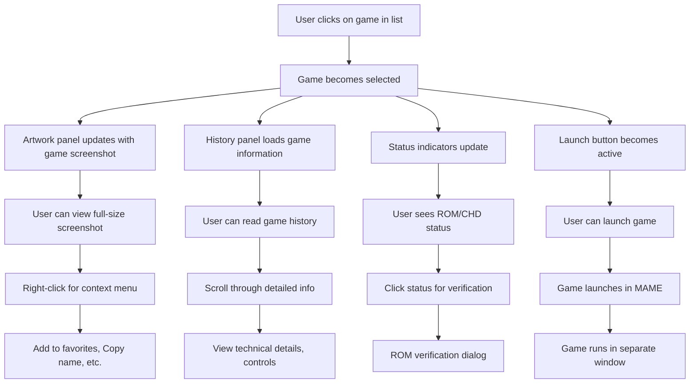
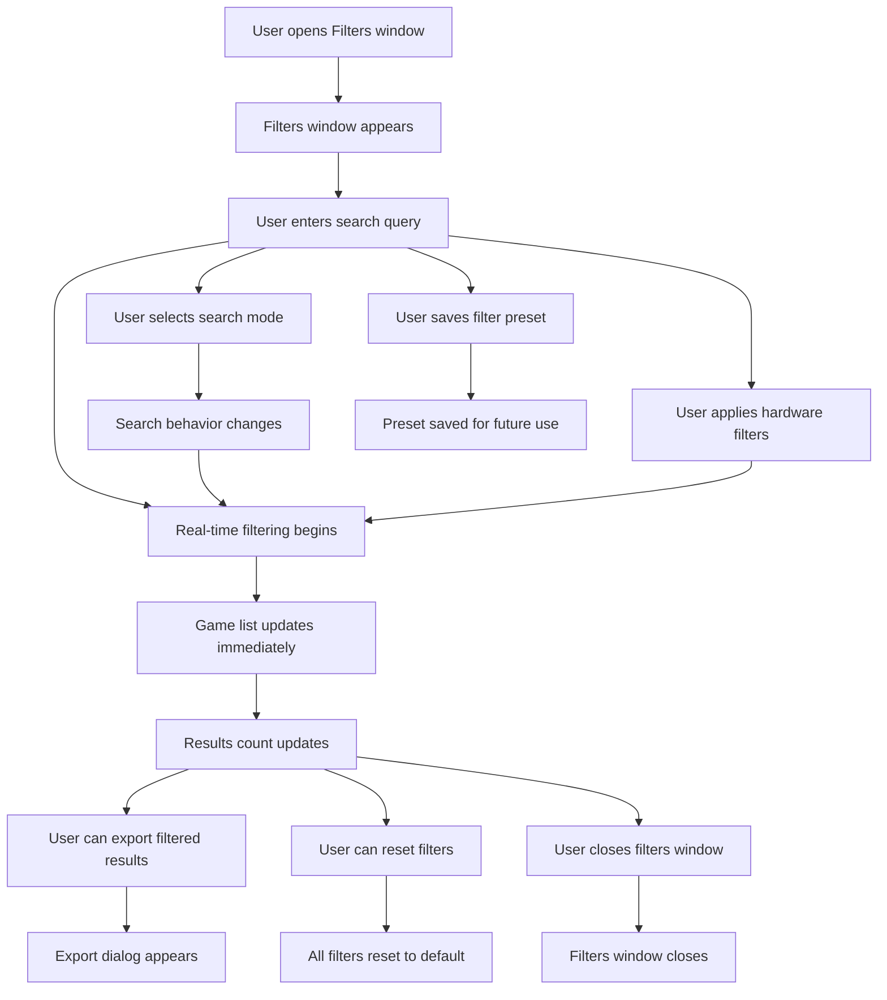
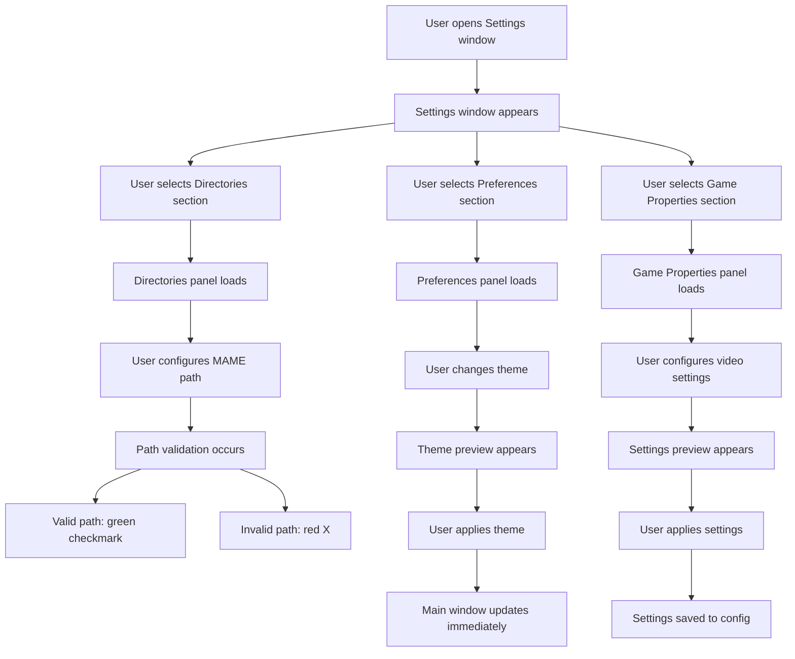
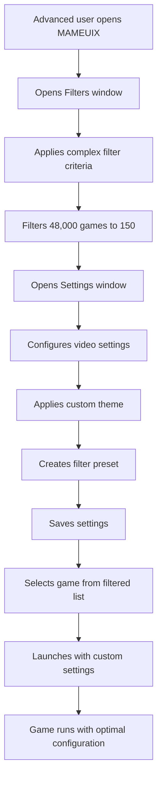

# MAMEUIX Refined UI Design & User Experience

## 🎨 Design System Overview

### Color Palette & Theming
```css
/* Primary Theme Colors */
--primary-blue: #3182ce;
--primary-green: #38a169;
--primary-purple: #805ad5;
--primary-orange: #ed8936;

/* Status Colors */
--status-available: #48bb78;
--status-missing: #f56565;
--status-warning: #ed8936;
--status-unknown: #a0aec0;

/* Background Colors */
--bg-primary: #1a202c;
--bg-secondary: #2d3748;
--bg-tertiary: #4a5568;
--bg-elevated: #2d3748;

/* Text Colors */
--text-primary: #f7fafc;
--text-secondary: #e2e8f0;
--text-muted: #a0aec0;
```

### Typography System
```css
/* Font Hierarchy */
--font-heading: 'Inter', system-ui, sans-serif;
--font-body: 'Inter', system-ui, sans-serif;
--font-mono: 'JetBrains Mono', 'Fira Code', monospace;

/* Font Sizes */
--text-xs: 0.75rem;   /* 12px */
--text-sm: 0.875rem;  /* 14px */
--text-base: 1rem;    /* 16px */
--text-lg: 1.125rem;  /* 18px */
--text-xl: 1.25rem;   /* 20px */
--text-2xl: 1.5rem;   /* 24px */
```

## 🖼️ Detailed Component Mockups

### 1. Main Window - Enhanced Layout

```
┌─────────────────────────────────────────────────────────────────────────────────────┐
│ 🎮 MAMEUIX                                    [─] [□] [✕]                          │
├─────────────────────────────────────────────────────────────────────────────────────┤
│ File  Settings  Filters  Tools  Help                                              │
│ 🔄 Refresh  🔍 Search: [________________________] [Clear] [Advanced Filters...]   │
│ Status: ✅ 1,247 Available | ❌ 45 Missing | ⚠️ 12 Warnings | ❓ 2,341 Not Verified │
├─────────────────────────────┬───────────────────────────────────────────────────────┤
│                             │                                                       │
│  [ Game List (60%) ]        │   +───────────────────────────────────────────────+   │
│  +─────────────────────────+ │   │              Artwork Panel                    │   │
│  │ ▼ ★ [I] ✅ Pac-Man   5 1980│ │   │            (Top 50%, 40% Width)              │   │
│  │ ▶ ☆ [I] ❌ Galaga    12 1981│ │   │   +─────────────────────────────────────+  │   │
│  │   ☆ [I] ⚠️ Ms. Pac-Man 3 1981│ │   │   │  [Screenshot Image - 320x240]      │  │   │
│  │   ★ [I] ❓ Ponpoko     1 1982│ │   │   │                                     │  │   │
│  │ ▼ ☆ [I] ✅ Donkey Kong 8 1981│ │   │   │  🎮 Pac-Man                          │  │   │
│  │   ...                         │ │   │   │  📅 1980 | 🏭 Namco | 🎯 Maze       │  │   │
│  │                               │ │   │   │  ✅ ROM Available | 🎮 5 Plays      │  │   │
│  │ (Scrollable game list)        │ │   │   │                                     │  │   │
│  │                               │ │   │   │  [Launch Game] [Add to Favorites]   │  │   │
│  +─────────────────────────+ │   │   +─────────────────────────────────────+  │   │
│                             │   +───────────────────────────────────────────────+   │
│                             │                                                       │
│                             │   +───────────────────────────────────────────────+   │
│                             │   │              History Panel                    │   │
│                             │   │           (Bottom 50%, 40% Width)             │   │
│                             │   │   +─────────────────────────────────────+  │   │
│                             │   │   │  📖 Game History & Information      │  │   │
│                             │   │   │                                     │  │   │
│                             │   │   │  Pac-Man is a maze arcade game      │  │   │
│                             │   │   │  developed by Namco and released    │  │   │
│                             │   │   │  in 1980. The player controls       │  │   │
│                             │   │   │  Pac-Man through a maze, eating     │  │   │
│                             │   │   │  dots while avoiding ghosts...       │  │   │
│                             │   │   │                                     │  │   │
│                             │   │   │  🎮 Controls:                        │  │   │
│                             │   │   │  • Arrow Keys - Move Pac-Man        │  │   │
│                             │   │   │  • Space - Start Game               │  │   │
│                             │   │   │  • P - Pause                        │  │   │
│                             │   │   │                                     │  │   │
│                             │   │   │  🔧 Technical Details:              │  │   │
│                             │   │   │  • CPU: Z80 @ 3.072 MHz             │  │   │
│                             │   │   │  • Sound: Namco WSG                 │  │   │
│                             │   │   │  • Display: 224x288, 16 colors      │  │   │
│                             │   │   +─────────────────────────────────────+  │   │
│                             │   +───────────────────────────────────────────────+   │
└─────────────────────────────┴───────────────────────────────────────────────────────┘
```

### 2. Game List - Detailed Column Structure

```
┌─────────────────────────────────────────────────────────────────────────────────────┐
│ ▼ ★ [I] Status Game Name    Plays Mfg    Year Driver Cat  ROM  CHD  Size    Last Play│
│ ├─────────────────────────────────────────────────────────────────────────────────────┤ │
│ ▶ ★ [I] ✅ Pac-Man         [5]  Namco   1980  pacman Maze ✅  ❌  256KB  2024-01-15 │ │
│ ▶ ☆ [I] ❌ Galaga          [12] Namco   1981  galaga Shoot❌  ❌  128KB  Never      │ │
│   ☆ [I] ⚠️ Ms. Pac-Man     [3]  Midway  1981  mspacman Maze⚠️  ❌  512KB  2024-01-10 │ │
│   ★ [I] ❓ Ponpoko         [1]  Namco   1982  ponpoko Misc ❓  ❌  256KB  Never      │ │
│ ▼ ☆ [I] ✅ Donkey Kong     [8]  Nintendo 1981  dkong Jump ✅  ❌  64KB   2024-01-12 │ │
│   ☆ [I] ✅ Donkey Kong Jr. [2]  Nintendo 1982  dkongjr Jump✅  ❌  64KB   2024-01-08 │ │
│   ☆ [I] ✅ Donkey Kong 3   [0]  Nintendo 1983  dkong3 Jump✅  ❌  64KB   Never      │ │
│   ...                                                                               │ │
└─────────────────────────────────────────────────────────────────────────────────────┘
```

### 3. Floating Filters Window - Enhanced Design

```
┌─────────────────────────────────────────────────────────────────────────────────────┐
│ 🔍 Advanced Filters                                    [─] [□] [✕]                  │
├─────────────────────────────────────────────────────────────────────────────────────┤
│                                                                                     │
│ 🔍 Search Configuration                                                             │
│ ┌─────────────────────────────────────────────────────────────────────────────────┐ │
│ │ Search Query: [_______pacman________] [🔍] [Clear] [Save Query]                │ │
│ │ Search Mode: [Game Title ▼] [Fuzzy Match: ☑] [Case Sensitive: ☐]              │ │
│ │ Search Fields: ☑ Name ☑ Manufacturer ☑ Description ☑ Category ☐ Driver       │ │
│ └─────────────────────────────────────────────────────────────────────────────────┘ │
│                                                                                     │
│ 📊 Status Filters                                                                   │
│ ┌─────────────────────────────────────────────────────────────────────────────────┐ │
│ │ (●) All Games   ( ) Available Only   ( ) Missing Only                          │ │
│ │ ( ) Working     ( ) Non-working       ( ) Favorites Only                        │ │
│ │ ( ) Verified    ( ) Not Verified      ( ) CHD Required                          │ │
│ │                                                                                 │ │
│ │ ROM Status: ☑ Available ☑ Missing ☑ Warning ☑ Not Verified                    │ │
│ │ CHD Status: ☑ Available ☑ Missing ☑ Not Required                              │ │
│ └─────────────────────────────────────────────────────────────────────────────────┘ │
│                                                                                     │
│ 🔧 Hardware Filters                                                                │
│ ┌─────────────────────────────────────────────────────────────────────────────────┐ │
│ │ CPU Family: [All ▼]  Sound Chip: [All ▼]  Display: [All ▼]                     │ │
│ │ Device Type: [All ▼]  Category: [All ▼]  Year Range: [1980-1990]               │ │
│ │                                                                                 │ │
│ │ Specific Filters:                                                              │ │
│ │ ☑ Z80 Games ☑ 6502 Games ☑ 68000 Games ☐ Custom CPU                           │ │
│ │ ☑ Namco WSG ☑ AY-3-8910 ☑ YM2151 ☐ Custom Sound                              │ │
│ └─────────────────────────────────────────────────────────────────────────────────┘ │
│                                                                                     │
│ 💾 Filter Presets                                                                   │
│ ┌─────────────────────────────────────────────────────────────────────────────────┐ │
│ │ [Load Preset ▼] [Save Current as Preset...] [Manage Presets...]                │ │
│ │ Recent: "Arcade Classics" "Capcom Games" "Verified Only" "Z80 Era"            │ │
│ └─────────────────────────────────────────────────────────────────────────────────┘ │
│                                                                                     │
│ [Apply Filters] [Reset All] [Export Results] [Close]                              │
│                                                                                     │
│ Results: 1,247 games found (filtered from 48,247 total) - Updated in real-time   │
│                                                                                     │
└─────────────────────────────────────────────────────────────────────────────────────┘
```

### 4. Floating Settings Window - Detailed Navigation

```
┌─────────────────────────────────────────────────────────────────────────────────────┐
│ ⚙️ Settings                                            [─] [□] [✕]                  │
├─────────────────────────────┬───────────────────────────────────────────────────────┤
│                             │                                                       │
│  📁 Directories             │  +─────────────────────────────────────────────────+ │
│                             │  │ 📁 MAME Executables                             │ │
│  ⚙️ Preferences             │  │ [Path 1] [Browse] [Test]                        │ │
│                             │  │ [Path 2] [Browse] [Test]                        │ │
│  🎮 Default Game            │  │ [Add Path] [Remove] [Auto-detect]               │ │
│     Properties              │  │                                                 │ │
│                             │  │ 📁 ROM Directories                              │ │
│  🎨 Themes                  │  │ [Path A] [Browse] [Scan]                        │ │
│                             │  │ [Path B] [Browse] [Scan]                        │ │
│  🔧 Advanced                │  │ [Add Path] [Remove] [Auto-scan]                 │ │
│                             │  │                                                 │ │
│                             │  │ 📁 CHD Directories                              │ │
│                             │  │ [Path X] [Browse] [Scan]                        │ │
│                             │  │ [Add Path] [Remove] [Auto-scan]                 │ │
│                             │  │                                                 │ │
│                             │  │ 📁 Artwork Paths                                │ │
│                             │  │ Screenshots: [________] [Browse]                │ │
│                             │  │ Flyers: [________] [Browse]                     │ │
│                             │  │ Titles: [________] [Browse]                     │ │
│                             │  │                                                 │ │
│                             │  │ [Apply] [OK] [Cancel] [Reset to Defaults]       │ │
│                             │  +─────────────────────────────────────────────────+ │
│                             │                                                       │
└─────────────────────────────┴───────────────────────────────────────────────────────┘
```

## 🔄 Interaction Flows & User Experience

### 1. Game Selection & Information Flow



### 2. Filtering & Search Flow



### 3. Settings Configuration Flow



## 🎯 Component Specifications

### 1. Game List Component

#### Properties
```rust
pub struct GameListProps {
    games: Vec<Game>,
    filtered_games: Vec<GameId>,
    selected_game: Option<GameId>,
    sort_column: Column,
    sort_direction: SortDirection,
    column_widths: HashMap<Column, f32>,
    expanded_games: HashSet<GameId>,
    virtual_scroll: VirtualScrollConfig,
}
```

#### Events
```rust
pub enum GameListEvent {
    GameSelected(GameId),
    GameDoubleClicked(GameId),
    GameRightClicked(GameId, Position),
    ColumnResized(Column, f32),
    ColumnSorted(Column, SortDirection),
    GameExpanded(GameId),
    GameCollapsed(GameId),
    FavoriteToggled(GameId),
}
```

#### Styling
```css
.game-list {
    background: var(--bg-secondary);
    border: 1px solid var(--border-color);
    border-radius: 4px;
}

.game-row {
    padding: 8px 12px;
    border-bottom: 1px solid var(--border-subtle);
    transition: background-color 0.15s ease;
}

.game-row:hover {
    background: var(--bg-hover);
}

.game-row.selected {
    background: var(--primary-blue);
    color: white;
}

.game-row.expanded {
    background: var(--bg-elevated);
}

.status-indicator {
    width: 16px;
    height: 16px;
    border-radius: 50%;
    display: inline-flex;
    align-items: center;
    justify-content: center;
    font-size: 10px;
}

.status-available { background: var(--status-available); }
.status-missing { background: var(--status-missing); }
.status-warning { background: var(--status-warning); }
.status-unknown { background: var(--status-unknown); }
```

### 2. Artwork Panel Component

#### Properties
```rust
pub struct ArtworkPanelProps {
    selected_game: Option<Game>,
    artwork_cache: ArtworkCache,
    display_mode: ArtworkDisplayMode,
    image_quality: ImageQuality,
    show_metadata: bool,
    show_actions: bool,
}
```

#### Features
- **Lazy loading** of artwork images
- **Multiple image formats** support (PNG, JPG, WebP)
- **Fallback images** for missing artwork
- **Zoom and pan** functionality
- **Context menu** for image operations
- **Metadata display** (resolution, file size, etc.)

#### Styling
```css
.artwork-panel {
    background: var(--bg-primary);
    border: 1px solid var(--border-color);
    border-radius: 4px;
    padding: 16px;
}

.artwork-image {
    max-width: 100%;
    max-height: 300px;
    object-fit: contain;
    border-radius: 4px;
    box-shadow: 0 2px 8px rgba(0, 0, 0, 0.3);
}

.artwork-metadata {
    margin-top: 12px;
    padding: 8px;
    background: var(--bg-secondary);
    border-radius: 4px;
    font-size: var(--text-sm);
}

.artwork-actions {
    margin-top: 12px;
    display: flex;
    gap: 8px;
}

.action-button {
    padding: 6px 12px;
    border: 1px solid var(--border-color);
    border-radius: 4px;
    background: var(--bg-secondary);
    color: var(--text-primary);
    cursor: pointer;
    transition: all 0.15s ease;
}

.action-button:hover {
    background: var(--primary-blue);
    border-color: var(--primary-blue);
}
```

### 3. History Panel Component

#### Properties
```rust
pub struct HistoryPanelProps {
    selected_game: Option<Game>,
    history_data: GameHistory,
    display_mode: HistoryDisplayMode,
    show_technical_details: bool,
    show_controls: bool,
    show_trivia: bool,
}
```

#### Features
- **Rich text rendering** with formatting
- **Collapsible sections** for different info types
- **Copy to clipboard** functionality
- **Search within history** text
- **External links** to MAME documentation
- **User notes** and annotations

#### Styling
```css
.history-panel {
    background: var(--bg-primary);
    border: 1px solid var(--border-color);
    border-radius: 4px;
    padding: 16px;
    overflow-y: auto;
    max-height: 400px;
}

.history-section {
    margin-bottom: 16px;
}

.history-section-title {
    font-size: var(--text-lg);
    font-weight: 600;
    color: var(--text-primary);
    margin-bottom: 8px;
    padding-bottom: 4px;
    border-bottom: 2px solid var(--primary-blue);
}

.history-content {
    font-size: var(--text-sm);
    line-height: 1.6;
    color: var(--text-secondary);
}

.history-content h3 {
    font-size: var(--text-base);
    font-weight: 600;
    color: var(--text-primary);
    margin: 12px 0 6px 0;
}

.history-content ul {
    margin: 8px 0;
    padding-left: 20px;
}

.history-content li {
    margin: 4px 0;
}

.technical-details {
    background: var(--bg-secondary);
    padding: 12px;
    border-radius: 4px;
    margin: 8px 0;
    font-family: var(--font-mono);
    font-size: var(--text-xs);
}
```

## 🎨 User Experience Workflows

### 1. First-Time User Onboarding

```mermaid
graph TD
    A[User launches MAMEUIX] --> B[Welcome screen appears]
    B --> C[User clicks "Get Started"]
    C --> D[Directory setup wizard]
    D --> E[User selects MAME executable]
    E --> F[Auto-detect ROM directories]
    F --> G[Scan for games]
    G --> H[Show results summary]
    H --> I[User clicks "Finish Setup"]
    I --> J[Main interface loads]
    J --> K[Show quick tour overlay]
    K --> L[User dismisses tour]
    L --> M[User can start browsing games]
```

### 2. Daily Usage Workflow

```mermaid
graph TD
    A[User opens MAMEUIX] --> B[Main window loads with last state]
    B --> C[User sees favorite games highlighted]
    C --> D[User searches for specific game]
    D --> E[Game appears in filtered list]
    E --> F[User selects game]
    F --> G[Game info loads in side panels]
    G --> H[User clicks "Launch Game"]
    H --> I[Game starts in MAME]
    I --> J[User plays game]
    J --> K[User closes game]
    K --> L[Return to MAMEUIX]
    L --> M[Play count updates automatically]
```

### 3. Advanced User Workflow



## 📱 Responsive Design Considerations

### Desktop Layout (1200px+)
- **Full layout** with all panels visible
- **Maximum information density**
- **All features accessible**

### Tablet Layout (768px - 1199px)
- **Collapsible side panels**
- **Touch-friendly controls**
- **Simplified navigation**

### Mobile Layout (< 768px)
- **Single-column layout**
- **Modal dialogs for settings/filters**
- **Gesture-based navigation**

## 🎯 Accessibility Features

### Keyboard Navigation
- **Tab order** through all interactive elements
- **Arrow keys** for game list navigation
- **Enter/Space** for selection
- **Escape** to close dialogs

### Screen Reader Support
- **ARIA labels** for all interactive elements
- **Semantic HTML** structure
- **Alt text** for all images
- **Status announcements** for dynamic content

### Visual Accessibility
- **High contrast mode** support
- **Font scaling** up to 200%
- **Color-blind friendly** status indicators
- **Reduced motion** option for animations

This refined design provides a comprehensive, professional, and user-friendly interface that scales from casual users to power users while maintaining excellent performance and accessibility. 