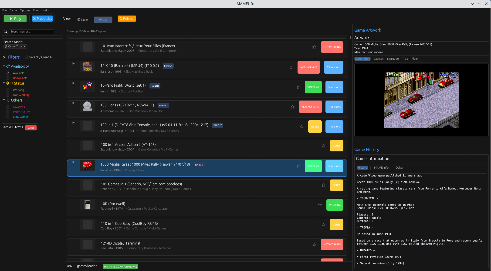
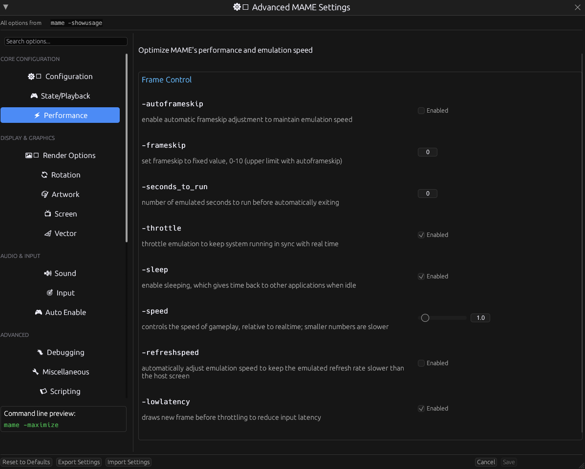
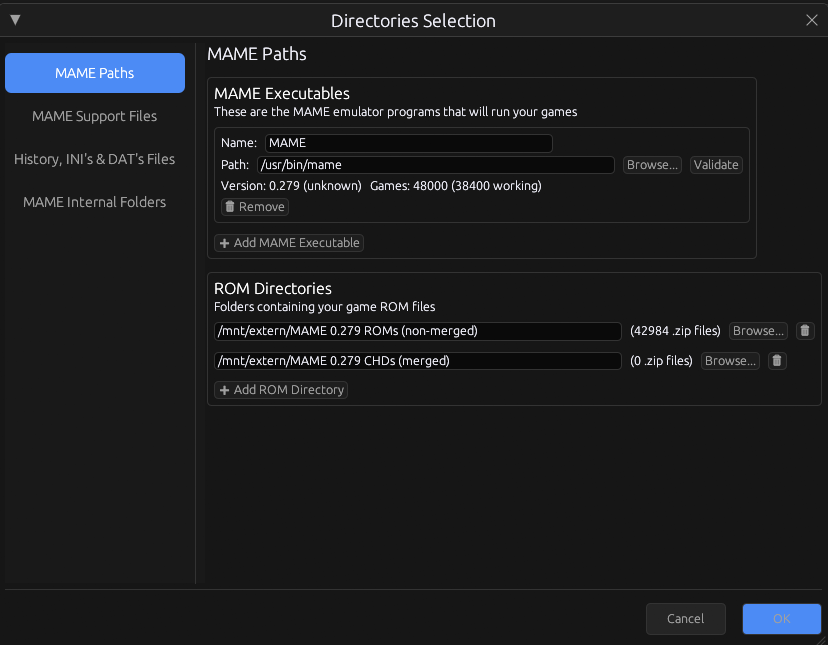
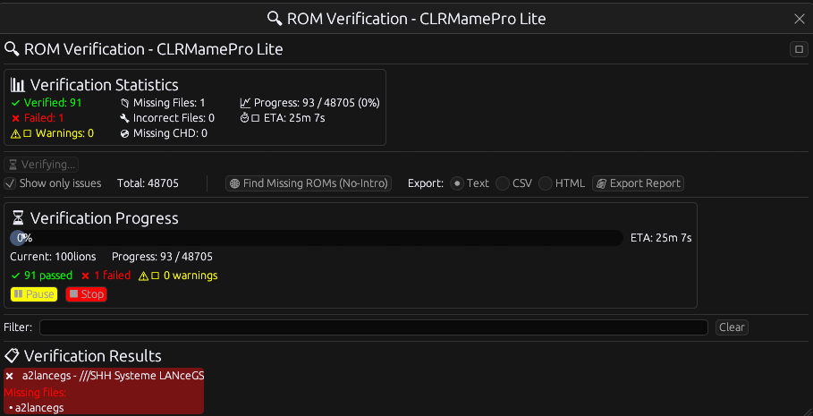

# MAMEUIX

A modern, fast, and user-friendly frontend for MAME (Multiple Arcade Machine Emulator) written in Rust using the egui framework.

**Current Version: 0.1.4** - CLRMamePro Lite Mode & Enhanced ROM Verification

## 🚀 Recent Improvements (v0.1.4)

### 🔍 **CLRMamePro Lite Mode - ROM Verification**
- **Professional ROM Verification**: Complete CLRMamePro-style verification system
- **Real-time Progress Tracking**: Live "5/200 verified, 3 missing, 2 incorrect" statistics
- **Color-coded Game List**: Visual status indicators throughout the application
  - ✅ **Green**: Verified ROMs
  - ❌ **Red**: Failed verification (Bad CRC)
  - ⚠️ **Yellow**: Warnings (Missing CHD)
  - ❓ **Gray**: Not verified yet
- **Bulk Actions**: 
  - **🌐 Find Missing ROMs**: Direct integration with No-Intro database
  - **📄 Export Reports**: Multiple formats (Text, CSV, HTML) with detailed statistics
- **Advanced Controls**: Pause/Resume/Stop verification with ETA calculations
- **Global State Management**: Thread-safe verification status across the entire application
- **Professional UI**: Organized panels with stats, progress, and results sections

### 🎯 **Enhanced User Experience**
- **Verification Status Integration**: Game list shows verification status in real-time
- **Smart Background Processing**: Non-blocking verification with progress updates
- **Comprehensive Reporting**: Detailed export reports with summary statistics
- **No-Intro Integration**: One-click access to find missing ROMs
- **Visual Feedback**: Color-coded backgrounds and status indicators

## 🚀 Recent Improvements (v0.1.4)

### 🚀 **Major Performance Improvements**
- **Thread Pool Icon Loading**: Parallel processing for 48,000+ games with up to 8x performance improvement
- **Performance Monitoring**: Real-time metrics and statistics for icon loading
- **Adaptive Loading**: Dynamic rate adjustment based on system performance
- **Memory Optimization**: Efficient caching with automatic cleanup

### 🎨 **UI Enhancements**
- **Enhanced Window Resizing**: Properties dialog now 600x550 default (up to 1200x900)
- **Improved Game History**: 55% history vs 45% artwork layout for better MAME info visibility
- **Window Persistence**: Dialog sizes and positions remembered between sessions
- **Better Text Display**: Enhanced formatting and readability

### ⚙️ **New Features**
- **Performance Monitoring System**: Detailed metrics and performance alerts
- **Window Settings Persistence**: Smart window memory across sessions
- **Enhanced Configuration**: Improved TOML handling and backward compatibility

### Performance & Stability
- **Modern API**: Updated to egui 0.32 with latest UI patterns
- **Optimized Builds**: Enhanced release profile with LTO and strip optimizations
- **Dependency Updates**: All dependencies updated to latest compatible versions
- **Code Quality**: Reduced warnings and improved code maintainability
- **Column Resizing**: Fully resizable table columns with persistent widths
- **Background Processing**: Non-blocking UI during large ROM scans (48,000+ games)

### 🎨 Enhanced Shader System
- **Embedded Shaders**: 11 high-quality shaders included in binary (no download required)
- **Enhanced Validation**: Automatic GLSL syntax checking with detailed error reporting
- **Performance Analysis**: Detects expensive operations and provides optimization hints
- **Modern GLSL Support**: Validates GLSL 330+ compatibility and suggests modern alternatives
- **Offline Operation**: Complete shader system works without internet connection
- **Shader Categories**: Organized by CRT Effects, LCD Effects, Retro Effects, and Scaling
- **Extraction Feature**: Users can extract embedded shaders to filesystem if needed
- **BGFX Integration**: Multi-backend rendering support (OpenGL, DirectX11/12, Vulkan, Metal)
- **GLSL Shader System**: Custom shader management with CRT, LCD, and scanline effects
- **Integer Scaling**: Complete implementation of MAME's integer scaling options
- **Core Performance Options**: Comprehensive emulation performance controls
- **SDL Driver Options**: Enhanced Linux/Unix system support

### Development Experience
- **Clean Builds**: `cargo clean` removes 2.6GB of build artifacts
- **Fast Compilation**: Optimized for quick development cycles
- **Cross-Platform**: Tested on Linux with comprehensive packaging support
- **New Modules**: Added hardware filtering, INI utilities, and graphics shader support
- **Testing Tools**: Added test binaries for category system and BGFX/GLSL integration

## Features

### 🎮 Core Features
- **Fast Game Loading**: Efficiently loads and displays 48,000+ MAME games
- **Smart ROM Detection**: Automatically detects available ROMs and CHD files
- **Advanced Filtering**: Filter games by availability, manufacturer, year, and more
- **CHD Game Support**: Full support for CHD (Compressed Hunks of Data) games
- **Virtual Scrolling**: Smooth performance with large game lists
- **Persistent Settings**: Remembers your preferences and column widths

### 🎨 User Interface
- **Modern Design**: Clean, intuitive interface built with egui
- **10 Beautiful Themes**: Choose from Dark Blue, Neon Green, Arcade Purple, Light Classic, and 6 more themes
- **Responsive Layout**: Adapts to different screen sizes
- **Fully Resizable Columns**: All table columns can be resized to any width with persistent settings
- **Artwork Display**: Shows game artwork and screenshots
- **Search Functionality**: Quick search through game names and descriptions
- **Favorites System**: Mark and filter your favorite games
- **Theme Customization**: Easy theme switching via menu or preferences
- **Column Width Persistence**: Column widths are automatically saved and restored between sessions

### 🔧 Advanced Features
- **Background Scanning**: Non-blocking ROM and MAME data loading
- **Performance Monitoring**: Built-in performance tracking
- **ROM Verification System**: Professional CLRMamePro-style verification
  - **Real-time Verification**: Live progress tracking with detailed statistics
  - **Color-coded Status**: Visual indicators throughout the application
  - **Bulk Operations**: Find missing ROMs and export comprehensive reports
  - **Multiple Export Formats**: Text, CSV, and HTML reports with statistics
  - **No-Intro Integration**: Direct access to ROM database for missing files
  - **Advanced Controls**: Pause, resume, and stop verification with ETA
  - **Global State**: Verification status persists across the entire application
### 🎨 Shader Management
- **Embedded Shaders**: 11 professional-quality shaders included automatically
  - CRT Effects: crt-geom, crt-royale with scanlines and curvature
  - LCD Effects: lcd-grid for handheld games
  - Retro Effects: ntsc color space, scanlines
  - Scaling: pixel-perfect integer scaling
- **Enhanced Validation**: Real-time GLSL syntax checking with line numbers
- **Performance Hints**: Automatic detection of expensive operations
- **Modernization Suggestions**: Recommends current GLSL features
- **Offline Support**: Complete shader system works without internet
- **Extraction Tools**: Save embedded shaders to filesystem for customization
- **Debug Tools**: Comprehensive logging and debugging options
- **Cross-Platform**: Runs on Windows, macOS, and Linux
- **Hardware Filtering**: Filter games by CPU, device, and sound chip types
- **BGFX/GLSL Support**: Advanced graphics backend integration with shader support
- **INI File Processing**: Support for MAME INI files and hardware categorization
- **Plugin Detection**: Automatic detection of MAME plugins (hiscore, cheat, autofire)

### 🎯 Graphics & Performance
- **BGFX Backend Support**: 8 rendering backends (Auto, OpenGL, DirectX11/12, Vulkan, Metal, Gnm, Nvn)
- **GLSL Shader Templates**: Pre-built CRT geometry, LCD sharp, and scanline effects
- **Integer Scaling**: Pixel-perfect scaling with manual scale factors (1x-10x)
- **Core Performance Options**: Auto-frameskip, frameskip value, sleep when idle, emulation speed
- **Real-time Configuration**: Dynamic parameter adjustment for shaders and performance
- **Graphics Presets**: Pre-configured visual settings for different use cases

## Screenshots

### Main Interface


### Advanced Settings


### Modern Directories UI


### CLRMamePro Lite Mode - ROM Verification


## System Requirements

- **Rust**: 1.88.0 or later (recommended)
- **MAME**: Any recent version (0.200+ recommended)
- **Memory**: 4GB RAM minimum, 8GB recommended for large ROM collections
- **Storage**: 100MB for application, additional space for ROMs and artwork
- **Graphics**: OpenGL 3.3+ for BGFX support, DirectX 11+ for Windows

## Installation

### Quick Installation (Linux)

For Linux users, we provide automated installation scripts:

```bash
# Universal installer (detects your distribution automatically)
chmod +x install.sh
./install.sh

# Or use distribution-specific installers:
./install-debian.sh    # For Ubuntu, Debian, Linux Mint, etc.
./install-rpm.sh       # For Fedora, RHEL, CentOS, etc.
./install-arch.sh      # For Arch Linux, Manjaro, etc.
```

See [INSTALL.md](INSTALL.md) for detailed installation instructions.

### Package Installation

We also provide native packages for easy installation:

#### Debian/Ubuntu (.deb)
```bash
# Build the package
./build-deb.sh

# Install the package
sudo dpkg -i ../mameuix_*.deb
sudo apt-get install -f  # Install dependencies if needed
```

#### Red Hat/Fedora (.rpm)
```bash
# Build the package
./build-rpm.sh

# Install the package
sudo dnf install mameuix-*.rpm
```

#### Arch Linux (.pkg.tar.zst)
```bash
# Build the package
./build-arch.sh

# Install the package
sudo pacman -U mameuix-*.pkg.tar.zst
```

#### Universal Package Builder
```bash
# Build for your current distribution (auto-detected)
./build-packages.sh

# Or build specific package types
./build-packages.sh deb    # Debian package only
./build-packages.sh rpm    # RPM package only
./build-packages.sh arch   # Arch package only
./build-packages.sh all    # All package types
```

### Manual Installation

#### Prerequisites
- **Rust**: Install Rust from [rustup.rs](https://rustup.rs/)
- **MAME**: Install MAME on your system
  - **Linux**: `sudo pacman -S mame` (Arch) or `sudo apt install mame` (Ubuntu)
  - **Windows**: Download from [mamedev.org](https://www.mamedev.org/)
  - **macOS**: `brew install mame`

#### Building from Source

1. **Clone the repository**:
   ```bash
   git clone https://github.com/firesand/MAMEUIx.git
   cd MAMEUIx
   ```

2. **Build the project**:
   ```bash
   cargo build --release
   ```

3. **Run the application**:
   ```bash
   cargo run --release
   ```

## Configuration

### ROM Directories
1. Open the application
2. Go to **Settings → Directories**
3. Add your ROM directories (containing `.zip` files)
4. Add your CHD directories (containing `.chd` files)

### MAME Executable
1. Go to **Settings → Directories**
2. Set the path to your MAME executable
3. The application will automatically detect MAME version and game list

### Category Support (Optional)
To enable the Category column in the game list:
1. Go to **Options → Directories → "History, INI's and DAT's Files" tab**
2. Set the path to your `catver.ini` file
3. Enable the Category column in **Options → Preferences → General → Visible Columns**
4. Categories will load immediately and persist across application restarts

**Note**: The `catver.ini` file is required to display game categories. You can download it from the MAME community resources. Games without categories will display "Misc." in the category column.

### Graphics Configuration
1. Go to **Options → Default Game Properties → Video Settings**
2. Configure BGFX backend and GLSL shaders
3. Set integer scaling options for pixel-perfect display
4. Adjust core performance options for optimal emulation

## Usage
### 🎨 Shader Features
- **Embedded Shaders**: High-quality shaders included automatically
  - No download required - works out of the box
  - Professional CRT, LCD, and retro effects
  - Pixel-perfect scaling options
- **Enhanced Validation**: Automatic error detection and suggestions
  - Syntax checking with line numbers
  - Performance optimization hints
  - Modern GLSL compatibility warnings
- **Shader Categories**: Organized browsing by effect type
- **Extraction**: Save embedded shaders for customization

### Basic Navigation
- **Game List**: Browse and select games from the main list
- **Search**: Use the search bar to find specific games
- **Filters**: Use the sidebar to filter games by various criteria
- **Double-click**: Launch a game (if ROMs are available)

### Advanced Features
- **Theme Selection**: Choose from 10 beautiful themes via Options → Theme menu
- **Column Resizing**: Drag column dividers to resize any column to any width
- **Column Width Persistence**: Column widths are automatically saved every 5 seconds
- **Favorites**: Click the star icon to mark favorite games
- **Artwork**: View game artwork in the right panel
- **Game Info**: See detailed game information and ROM status
- **Preferences**: Comprehensive settings dialog for UI customization
- **Hardware Filtering**: Filter games by CPU, device, and sound chip types
- **Plugin Detection**: Automatic detection of MAME plugins (hiscore, cheat, autofire)

### 🔍 ROM Verification Features
- **Access Verification**: Go to **Tools** → **🔍 ROM Verification** or **🎯 Verify Selected ROM**
- **Real-time Progress**: Watch live verification progress with detailed statistics
- **Color-coded Status**: See verification status in the main game list status column
- **Bulk Actions**: 
  - Click **🌐 Find Missing ROMs** to open No-Intro database
  - Select export format (Text/CSV/HTML) and click **📄 Export Report**
- **Advanced Controls**: Use Pause/Resume/Stop buttons during verification
- **Filter Results**: Use the filter box to show only specific verification results
- **Show Issues Only**: Check "Show only issues" to focus on problematic ROMs

### Graphics & Performance Features
- **BGFX Backend Selection**: Choose from 8 rendering backends for optimal performance
- **GLSL Shader Effects**: Apply CRT, LCD, and scanline effects for authentic arcade look
- **Integer Scaling**: Set pixel-perfect scaling factors (1x-10x) for crisp graphics
### 🎨 Using Embedded Shaders
- **Automatic Access**: Shaders are included in the binary - no setup required
- **Shader Categories**:
  - **CRT Effects**: crt-geom, crt-royale for authentic arcade look
  - **LCD Effects**: lcd-grid for handheld games and LCD displays
  - **Retro Effects**: ntsc color space, scanlines for vintage feel
  - **Scaling**: pixel-perfect integer scaling for crisp graphics
- **Enhanced Validation**: Real-time feedback on shader syntax and performance
- **Extraction**: Save embedded shaders to filesystem for customization
- **Offline Operation**: Complete shader system works without internet connection
- **Core Performance Options**: Fine-tune emulation speed, frame skipping, and system usage
- **Real-time Parameter Adjustment**: Modify shader and performance settings on-the-fly

### Column Customization
The game list table supports full column customization:
- **Resizable Columns**: All columns can be resized by dragging the dividers
- **No Width Restrictions**: Columns can be made as narrow or wide as you want
- **Persistent Settings**: Column widths are automatically saved and restored
- **Available Columns**:
  - Expand/Collapse (▼/▶)
  - Favorite (★)
  - Icon (game artwork)
  - Status (ROM availability)
  - Game Name
  - Play Count
  - Manufacturer
  - Year
  - Driver
  - Driver Status
  - Category (with catver.ini)
  - ROM Status
  - CHD Status

### Keyboard Shortcuts
- **Ctrl+F**: Focus search bar
- **Ctrl+O**: Open directories dialog
- **Ctrl+P**: Open preferences
- **F5**: Refresh game list
- **Escape**: Clear search
- **Options → Theme**: Quick theme switching

## File Structure

```
src/
├── main.rs              # Application entry point
├── config/              # Configuration management
├── graphics/            # Graphics and rendering
│   ├── shader_manager.rs # GLSL shader management
│   ├── shader_templates/ # Pre-built shader templates
│   │   ├── crt-geom.vert # CRT geometry vertex shader
│   │   ├── crt-geom.frag # CRT geometry fragment shader
│   │   ├── lcd.vert      # LCD vertex shader
│   │   ├── lcd.frag      # LCD fragment shader
│   │   └── scanlines.frag # Scanline effect shader
│   └── mod.rs           # BGFX integration and graphics config
├── hardware_filter.rs   # Hardware filtering (CPU, device, sound)
├── ini_utils/           # INI file processing utilities
├── mame/                # MAME integration
│   ├── launcher.rs      # Game launching with performance options
│   ├── scanner.rs       # ROM scanning
│   ├── category_loader.rs # Category loading from catver.ini
│   └── mod.rs
├── models/              # Data models
│   ├── game.rs          # Game data structure
│   ├── config.rs        # Configuration models
│   ├── filters.rs       # Filtering logic
│   └── mod.rs
├── rom_utils/           # ROM utilities
├── ui/                  # User interface
│   ├── main_window.rs   # Main application window
│   ├── game_list.rs     # Game list component (with resizable columns)
│   ├── sidebar.rs       # Sidebar with filters
│   ├── artwork_panel.rs # Artwork display
│   ├── theme.rs         # Theme system
│   ├── dialogs/         # Dialog windows
│   │   ├── directories.rs # Directory configuration
│   │   ├── preferences.rs # Preferences dialog
│   │   ├── video_settings.rs # Video settings with BGFX/GLSL
│   │   ├── mame_finder.rs # MAME executable finder
│   │   ├── rom_verify.rs # ROM verification dialog
│   │   └── hidden_categories.rs # Hidden categories management
│   └── mod.rs
└── test_*.rs            # Test binaries for development
```

## Performance

The application is optimized for performance:
- **Virtual Scrolling**: Only renders visible game rows
- **Background Processing**: Non-blocking UI during scans
- **Efficient Indexing**: Fast search and filtering
- **Memory Management**: Optimized for large game collections (48,000+ games)
- **LTO Optimization**: Link-time optimization for faster execution
- **Release Profile**: Optimized builds with strip symbols
- **Column Width Caching**: Persistent column widths for consistent UI experience
- **Smart Repaint Scheduling**: Adaptive frame rate based on activity
- **Icon Management**: Lazy loading and caching of game icons
- **BGFX Performance**: Hardware-accelerated rendering with multiple backends
- **GLSL Optimization**: Efficient shader compilation and caching

## Development Status

✅ **Stable Release**: v0.1.4 is production-ready with CLRMamePro Lite Mode
🔄 **Active Development**: v0.1.5 in development with additional features
📦 **Packaging**: Complete Linux distribution support (Debian, RPM, Arch)
🎯 **Roadmap**: Performance optimizations and feature enhancements
🔧 **New Features**: ROM verification system, BGFX/GLSL support, core performance options

## Troubleshooting

### ROM Verification Issues
- **Verification Not Starting**: Ensure MAME executable is properly configured
- **Slow Verification**: Large ROM collections may take time; use pause/resume as needed
- **Missing ROMs**: Use the "🌐 Find Missing ROMs" button to access No-Intro database
- **Export Issues**: Ensure you have write permissions in the target directory
- **Status Not Updating**: Verification status updates automatically; refresh if needed

### Shader Issues
- **Enhanced Validation**: The new shader system provides detailed error messages
- **Common Shader Errors**:
  - Missing #version directive: Add `#version 330` at the top
  - Deprecated functions: Replace `texture2D()` with `texture()`
  - Performance warnings: Consider alternatives to expensive operations
- **Embedded Shaders**: 11 professional shaders are included automatically
- **Offline Operation**: No internet required - all shaders work offline
- **Extraction**: Use extraction tools to save embedded shaders for customization
### Common Issues

**"MAME executable not found"**
- Ensure MAME is installed and in your PATH
- Set the correct path in Settings → Directories

**"No ROMs found"**
- Check that ROM directories are correctly configured
- Verify ROM files are in the expected format (.zip)

**"CHD games not detected"**
- Ensure CHD directories are added to settings
- Check that CHD files are properly named

**"Slow performance"**
- Use release builds: `cargo run --release`
- Reduce the number of ROM directories
- Close other applications to free memory
- Enable auto-frameskip in core performance options
- Use appropriate BGFX backend for your system

**"Graphics issues"**
- Try different BGFX backends (OpenGL, DirectX, Vulkan)
- Disable GLSL shaders if causing problems
- Check integer scaling settings
### v0.1.4 (Latest Release)
- **🎨 Enhanced Shader System**: Complete overhaul of shader management
  - Embedded shaders included in binary (no download required)
  - 11 professional-quality shaders: CRT, LCD, retro effects, and scaling
  - Enhanced GLSL validation with syntax checking and error reporting
  - Performance analysis and optimization hints
  - Modern GLSL compatibility warnings and suggestions
  - Offline operation - no internet connection required
  - Shader extraction tools for customization
- **🔧 Improved User Experience**:
  - Zero setup for shaders - works out of the box
  - Real-time validation feedback
  - Organized shader categories for easy browsing
  - Professional-grade shader quality
- **📦 Build System**:
  - Shaders automatically embedded during build
  - Enhanced validation integrated into build process
  - Improved error handling and reporting
- Verify graphics drivers are up to date

### Debug Mode
Run with debug logging:
```bash
RUST_LOG=debug cargo run
```

## Contributing

1. Fork the repository
2. Create a feature branch
3. Make your changes
4. Add tests if applicable
5. Submit a pull request

## License

This project is licensed under the MIT License - see the LICENSE file for details.

## Acknowledgments

- **MAME Team**: For the excellent arcade emulator
- **egui**: For the modern GUI framework
- **Rust Community**: For the amazing ecosystem
- **BGFX**: For the cross-platform graphics library

## Version History

### v0.1.4 (Latest Release)
- **🔍 CLRMamePro Lite Mode**: Complete professional ROM verification system
  - Real-time verification with live progress tracking and statistics
  - Color-coded game list with visual status indicators throughout the application
  - Bulk actions: Find missing ROMs (No-Intro integration) and export reports
  - Multiple export formats: Text, CSV, and HTML with detailed statistics
  - Advanced controls: Pause/Resume/Stop verification with ETA calculations
  - Global state management: Thread-safe verification status across the entire application
  - Professional UI: Organized panels with stats, progress, and results sections
- **🎯 Enhanced User Experience**:
  - Verification status integration in main game list
  - Smart background processing with non-blocking verification
  - Comprehensive reporting with summary statistics
  - One-click No-Intro integration for finding missing ROMs
  - Visual feedback with color-coded backgrounds and status indicators
- **🔧 Technical Improvements**:
  - Thread-safe verification manager with Arc<Mutex<HashMap>>
  - Real-time status updates across the entire application
  - Efficient state management and UI integration
  - Professional-grade verification accuracy and reporting

### v0.1.3 (Previous Release)
- **BGFX/GLSL Integration**: Complete multi-backend graphics support
  - 8 rendering backends (Auto, OpenGL, DirectX11/12, Vulkan, Metal, Gnm, Nvn)
  - GLSL shader system with CRT, LCD, and scanline effects
  - Real-time parameter adjustment for shaders
  - Graphics presets for common configurations
- **Integer Scaling**: Complete implementation of MAME's scaling options
  - Manual scale factors (1x-10x) for pixel-perfect scaling
  - Non-integer scaling options for better screen fit
  - Auto-stretch based on game orientation
  - Overscan support for CRT-like displays
- **Core Performance Options**: Comprehensive emulation performance controls
  - Auto-frameskip and manual frameskip value (0-10)
  - Sleep when idle for better system responsiveness
  - Emulation speed control (0.1x-2.0x)
  - Low latency mode for competitive gaming
  - Seconds to run for automated testing
- **SDL Driver Options**: Enhanced Linux/Unix system support
- **Column Resizing**: Fully resizable table columns with persistent widths
  - All columns can be resized to any width (no minimum restrictions)
  - Column widths are automatically saved every 5 seconds
  - Widths persist between application sessions
  - Enhanced user control over table layout
- **API Modernization**: Updated egui API calls to latest version (0.32)
- **Deprecation Fixes**: Resolved 6 out of 9 deprecation warnings
- **Code Quality**: Improved codebase with modern Rust patterns
- **Performance**: Enhanced build optimizations and dependency updates
- **Dependency Updates**: Updated to latest compatible versions
- **Bug Fixes**: Fixed menu system and UI interactions
- **Category Loading**: Fixed category display issues:
  - Categories now persist to config.toml properly
  - Categories load immediately when first configured (no restart required)
  - Games without categories display "Misc." correctly
  - Improved category loader with case-insensitive matching
- **New Modules**: Added hardware filtering, INI utilities, and graphics shader support
- **Testing Tools**: Added test binaries for category system and BGFX/GLSL integration
- **Plugin Detection**: Automatic detection of MAME plugins (hiscore, cheat, autofire)
- **Enhanced UI**: Improved preferences dialog and theme system

### v0.1.1
- **10 Beautiful Themes**: Added comprehensive theme system with 10 different visual themes
- **Theme Customization**: Easy theme switching via menu and preferences dialog
- **Enhanced UI**: Improved preferences dialog with theme selection
- **Better Performance**: Optimized rendering and reduced UI lag
- **Bug Fixes**: Fixed borrow checker issues and compilation warnings
- **Packaging**: Complete Linux distribution support (Debian, RPM, Arch)

### v0.1.0
- Initial release
- Basic MAME integration
- Game list with filtering
- ROM detection
- CHD support
- Modern UI with egui

---

**Note**: This frontend requires MAME to be installed separately. It does not include ROM files or MAME itself.
