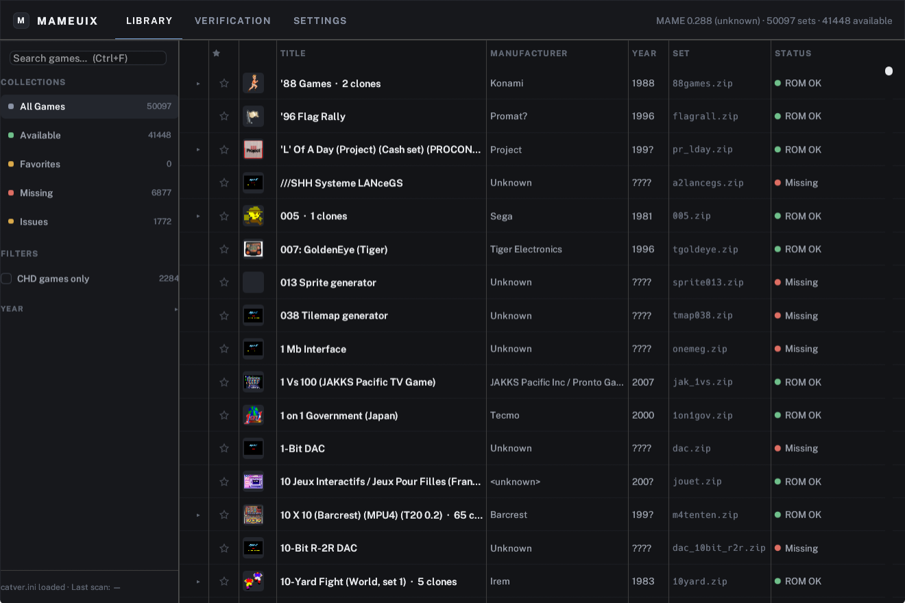
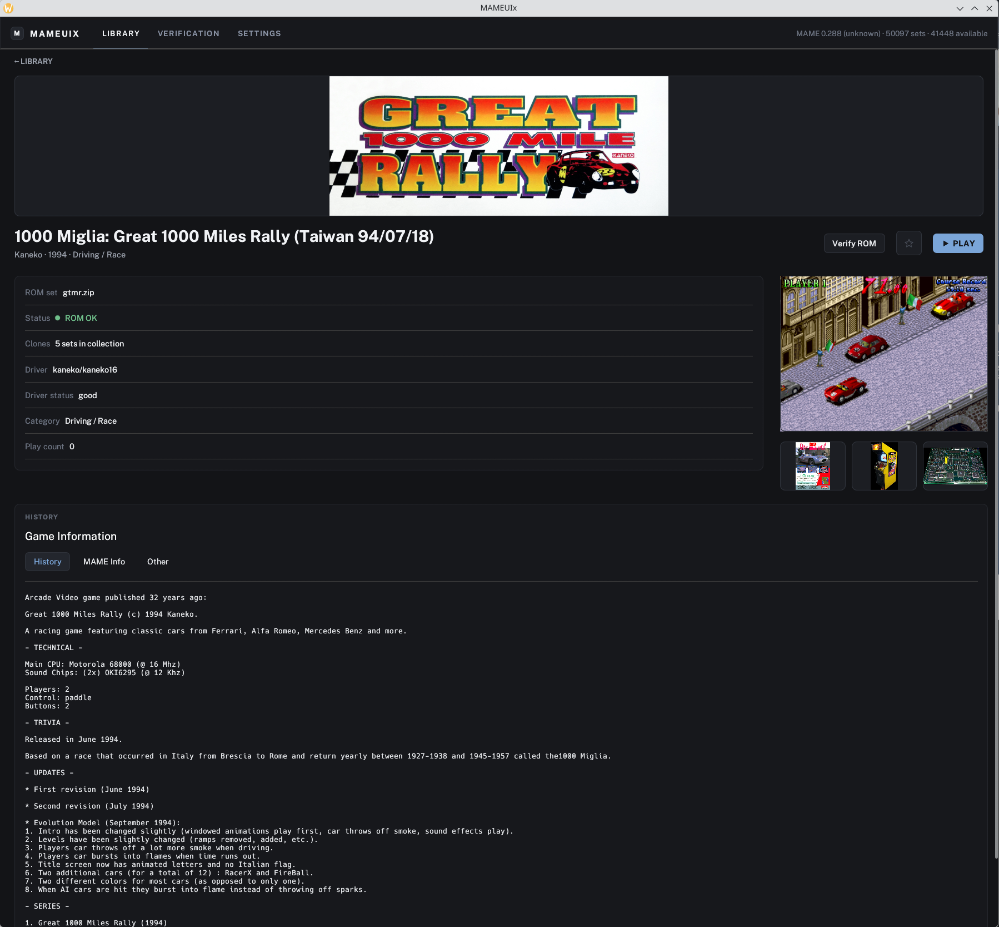
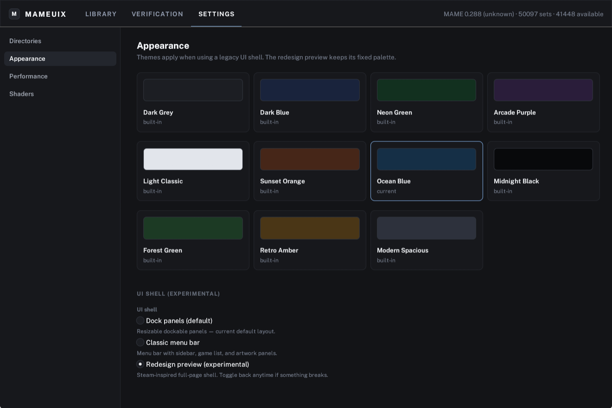
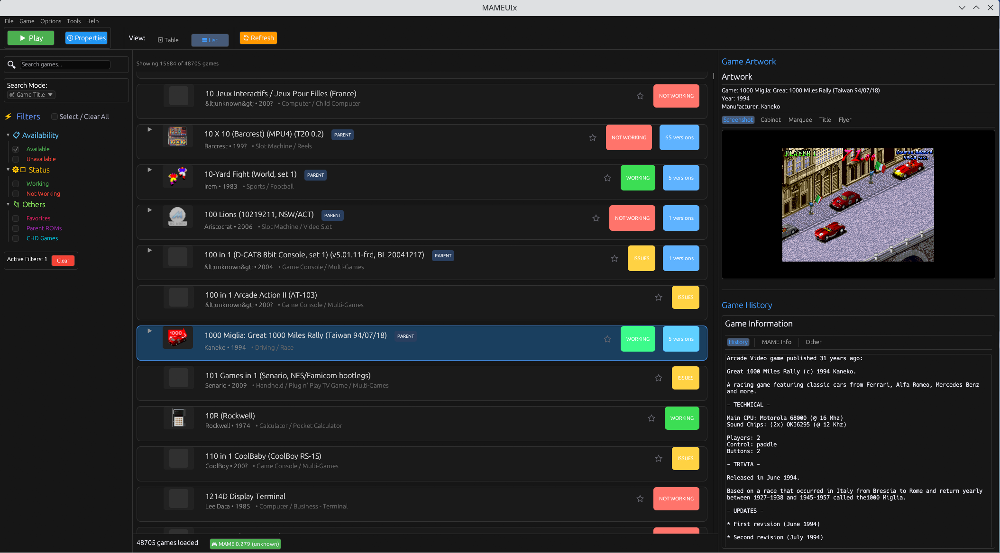
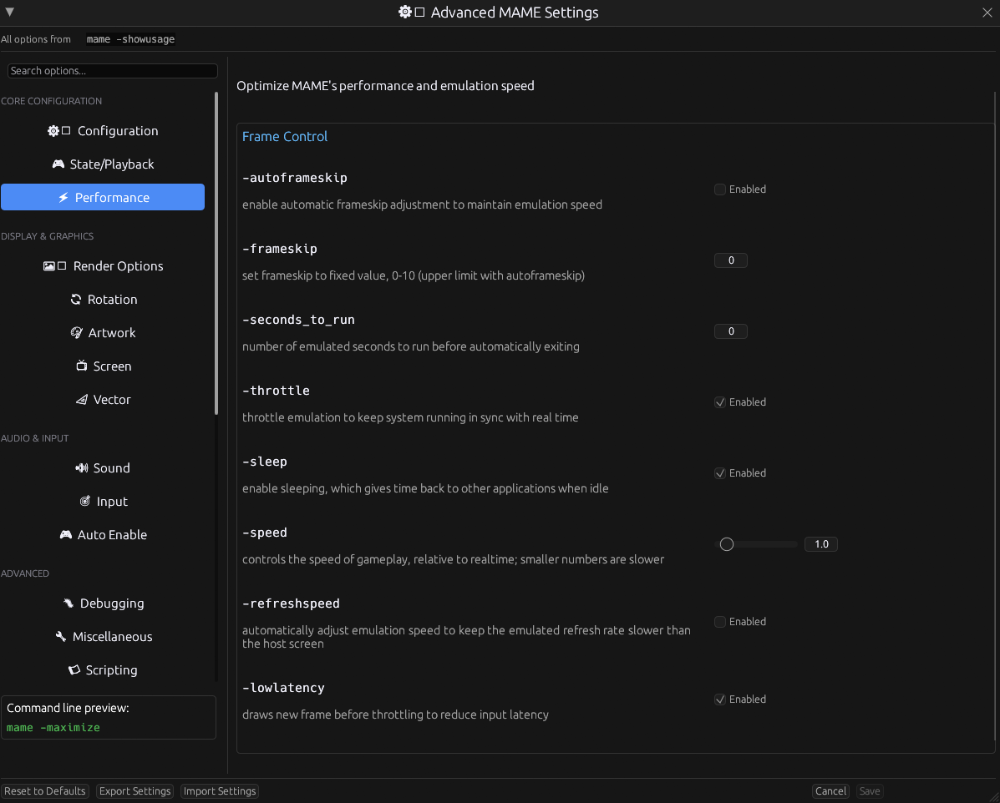
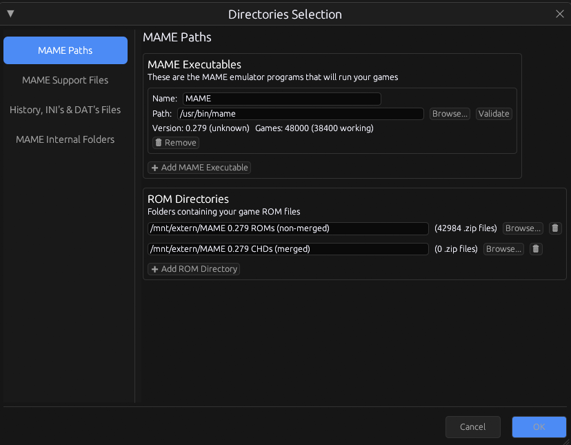
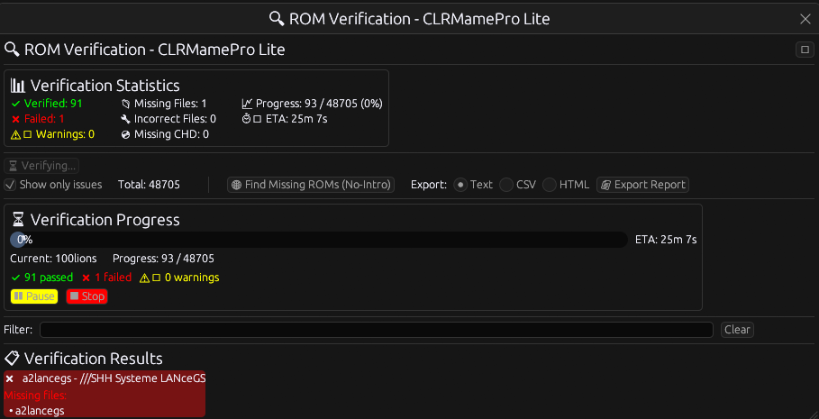

# MAMEUIX

A modern, fast, and user-friendly frontend for MAME (Multiple Arcade Machine Emulator) written in Rust using the egui framework.

**Current Version: 0.1.6** - Experimental Redesign and Software Lists Preview

## Recent Improvements (v0.1.6)

- Added an opt-in, experimental redesigned UI; the dock-panel UI remains the default
- Added a Software Lists preview for browsing MAME hash XML and checking best-effort media-path presence
- Made `Ctrl`/`Cmd`+`F` focus the redesign search field and separated Missing from Issues filtering
- Added scrolling to redesign settings and prevented legacy themes from replacing redesign styles
- Replaced misleading redesign shader Apply controls with read-only BGFX status and clear integration limits
- Simplified the About dialog and reorganized public guides under `docs/`
- Added initial, unverified FreeBSD amd64 source-build readiness

Enable the redesign from **Preferences → UI shell → Redesign preview (experimental)** or launch MAMEUIx with `--redesign`. You can switch back to the default dock-panel UI at any time.

## Previous Improvements (v0.1.5)

- Fixed core unit tests and restored a clean `cargo test --bin mameuix` baseline
- Excluded stale auto-discovered examples from the default test/build gate
- Replaced the main MAME XML scanner path with `quick-xml` parsing
- Removed the stale duplicate app entry file
- Improved ROM scan progress reporting while preserving CHD status handling
- Made icon loading use a local Rayon thread pool instead of a global pool initializer

## Recent Improvements (v0.1.4)

### CLRMamePro Lite Mode — ROM Verification
- **Professional ROM Verification**: Complete CLRMamePro-style verification system
- **Real-time Progress Tracking**: Live "5/200 verified, 3 missing, 2 incorrect" statistics
- **Color-coded Game List**: Visual status indicators throughout the application
  - ✅ **Green**: Verified ROMs
  - ❌ **Red**: Failed verification (Bad CRC)
  - ⚠️ **Yellow**: Warnings (Missing CHD)
  - ❓ **Gray**: Not verified yet
- **Bulk Actions**: 
  - **🌐 Find Missing ROMs**: Direct integration with No-Intro database
  - **📄 Export Reports**: Multiple formats (Text, CSV, HTML) with detailed statistics
- **Advanced Controls**: Pause/Resume/Stop verification with ETA calculations
- **Global State Management**: Thread-safe verification status across the entire application
- **Professional UI**: Organized panels with stats, progress, and results sections

### Enhanced User Experience (v0.1.4)
- **Verification Status Integration**: Game list shows verification status in real-time
- **Smart Background Processing**: Non-blocking verification with progress updates
- **Comprehensive Reporting**: Detailed export reports with summary statistics
- **No-Intro Integration**: One-click access to find missing ROMs
- **Visual Feedback**: Color-coded backgrounds and status indicators

### Performance System (v0.1.4)
- **Thread Pool Icon Loading**: Parallel processing for 48,000+ games with up to 8x performance improvement
- **Performance Monitoring**: Real-time metrics and statistics for icon loading
- **Adaptive Loading**: Dynamic rate adjustment based on system performance
- **Memory Optimization**: Efficient caching with automatic cleanup

### 🎨 **UI Enhancements**
- **Enhanced Window Resizing**: Properties dialog now 600x550 default (up to 1200x900)
- **Improved Game History**: 55% history vs 45% artwork layout for better MAME info visibility
- **Window Persistence**: Dialog sizes and positions remembered between sessions
- **Better Text Display**: Enhanced formatting and readability

### ⚙️ **New Features**
- **Performance Monitoring System**: Detailed metrics and performance alerts
- **Window Settings Persistence**: Smart window memory across sessions
- **Enhanced Configuration**: Improved TOML handling and backward compatibility

### Performance & Stability
- **Modern API**: Updated to egui 0.32 with latest UI patterns
- **Optimized Builds**: Enhanced release profile with LTO and strip optimizations
- **Dependency Updates**: All dependencies updated to latest compatible versions
- **Code Quality**: Reduced warnings and improved code maintainability
- **Column Resizing**: Fully resizable table columns with persistent widths
- **Background Processing**: Non-blocking UI during large ROM scans (48,000+ games)

### 🎨 MAME Graphics Configuration
- **Active BGFX Launch Options**: MAMEUIx passes the selected video mode, backend, screen chain, debug, shadow-mask, and LUT options to the external MAME process
- **Platform-aware Backend Choices**: The UI filters backend choices by host platform; actual availability depends on the installed MAME build and graphics driver
- **MAME-owned Rendering**: MAME renders the emulated game and applies BGFX chains; the MAMEUIx window continues to use `eframe`/`egui`
- **Experimental GLSL Tooling**: Preset helpers, validation code, and embedded GLSL sources exist, but custom/embedded shader selection is not yet connected end-to-end to the active launcher
- **Technical Guide**: See [BGFX and GLSL Configuration](docs/BGFX_GLSL_INTEGRATION.md) for the supported path and current limitations
- **Integer Scaling**: Complete implementation of MAME's integer scaling options
- **Core Performance Options**: Comprehensive emulation performance controls
- **SDL Driver Options**: Enhanced Linux/Unix system support

### Development Experience
- **Clean Builds**: `cargo clean` removes 2.6GB of build artifacts
- **Fast Compilation**: Optimized for quick development cycles
- **Cross-Platform**: Tested on Linux with comprehensive packaging support
- **New Modules**: Added hardware filtering, INI utilities, and experimental graphics helpers

## Features

### 🎮 Core Features
- **Fast Game Loading**: Efficiently loads and displays 48,000+ MAME games
- **Smart ROM Detection**: Automatically detects available ROMs and CHD files
- **Advanced Filtering**: Filter games by availability, manufacturer, year, and more
- **CHD Game Support**: Full support for CHD (Compressed Hunks of Data) games
- **Virtual Scrolling**: Smooth performance with large game lists
- **Persistent Settings**: Remembers your preferences and column widths

### 🎨 User Interface
- **Modern Design**: Clean, intuitive interface built with egui
- **10 Beautiful Themes**: Choose from Dark Blue, Neon Green, Arcade Purple, Light Classic, and 6 more themes
- **Responsive Layout**: Adapts to different screen sizes
- **Fully Resizable Columns**: All table columns can be resized to any width with persistent settings
- **Artwork Display**: Shows game artwork and screenshots
- **Search Functionality**: Quick search through game names and descriptions
- **Favorites System**: Mark and filter your favorite games
- **Theme Customization**: Easy theme switching via menu or preferences
- **Column Width Persistence**: Column widths are automatically saved and restored between sessions

### 🔧 Advanced Features
- **Background Scanning**: Non-blocking ROM and MAME data loading
- **Performance Monitoring**: Built-in performance tracking
- **ROM Verification System**: Professional CLRMamePro-style verification
  - **Real-time Verification**: Live progress tracking with detailed statistics
  - **Color-coded Status**: Visual indicators throughout the application
  - **Bulk Operations**: Find missing ROMs and export comprehensive reports
  - **Multiple Export Formats**: Text, CSV, and HTML reports with statistics
  - **No-Intro Integration**: Direct access to ROM database for missing files
  - **Advanced Controls**: Pause, resume, and stop verification with ETA
  - **Global State**: Verification status persists across the entire application

### 🎨 Graphics and Integration
- **BGFX Launch Configuration**: Active launcher support for MAME's BGFX video mode, platform-appropriate backend selection, screen chains, debug mode, shadow masks, and LUTs
- **External Chain Assets**: BGFX chain names must exist in the installed MAME data; embedded `.vert`/`.frag` sources are not MAME BGFX chain definitions
- **Experimental Custom GLSL**: UI fields, command-preview code, presets, validation helpers, and embedded sources are present, but the launcher does not yet forward custom GLSL selections
- **Implementation Status**: See [BGFX and GLSL Configuration](docs/BGFX_GLSL_INTEGRATION.md)
- **Platform status**: Linux supported; FreeBSD amd64 source builds are experimental
- **Hardware Filtering**: Filter games by CPU, device, and sound chip types
- **INI File Processing**: Support for MAME INI files and hardware categorization
- **Plugin Detection**: Automatic detection of MAME plugins (hiscore, cheat, autofire)

### 🎯 Graphics & Performance
- **BGFX Backend Configuration**: Backend choices are filtered for Linux, Windows, and macOS; MAME determines whether a selected backend is usable
- **BGFX Screen Chains**: MAMEUIx can pass a configured chain name to MAME
- **Experimental Shader Helpers**: CRT, LCD, scanline, and other GLSL sources are development assets, not a fully wired runtime shader system
- **Integer Scaling**: Pixel-perfect scaling with manual scale factors (1x-10x)
- **Core Performance Options**: Auto-frameskip, frameskip value, sleep when idle, emulation speed

## Screenshots

### Experimental Redesign Preview (v0.1.6)






### Main Interface


### Advanced Settings


### Modern Directories UI


### CLRMamePro Lite Mode - ROM Verification


## System Requirements

- **OS**: Linux; FreeBSD amd64 is an experimental source-build target
- **Rust**: 1.85.0 or later when building from source
- **MAME**: Any recent version (0.200+ recommended)
- **Memory**: 4GB RAM minimum, 8GB recommended for large ROM collections
- **Storage**: 100MB for application, additional space for ROMs and artwork
- **Graphics**: OpenGL-capable driver; additional MAME backends depend on the platform

## Installation

### AppImage (recommended for Linux)

```bash
chmod +x MAMEUIx-*.AppImage
./MAMEUIx-*.AppImage
```

Pre-built AppImages are attached to [GitHub Releases](https://github.com/firesand/MAMEUIx/releases). MAME must be installed separately.

### Arch Linux (AUR)

Use the standard AUR workflow:

```bash
git clone https://aur.archlinux.org/mameuix.git
cd mameuix
makepkg -si
```

Alternatively, use an installed AUR helper:

```bash
yay -S mameuix
# or: paru -S mameuix
```

### Build from source

```bash
git clone https://github.com/firesand/MAMEUIx.git
cd MAMEUIx
cargo build --release --locked
./target/release/mameuix
```

Packaging recipes for Debian, RPM, Arch, and Gentoo, plus dependency and experimental FreeBSD instructions, are in the [installation guide](docs/INSTALL.md). The Arch AUR package has passed a clean build; the Debian and RPM recipes still require clean-distribution validation. The public documentation index is under [`docs/`](docs/README.md).

## Configuration

### ROM Directories
1. Open the application
2. Go to **Settings → Directories**
3. Add your ROM directories (containing `.zip` files)
4. Add your CHD directories (containing `.chd` files)

### MAME Executable
1. Go to **Settings → Directories**
2. Set the path to your MAME executable
3. The application will automatically detect MAME version and game list

### Category Support (Optional)
To enable the Category column in the game list:
1. Go to **Options → Directories → "History, INI's and DAT's Files" tab**
2. Set the path to your `catver.ini` file
3. Enable the Category column in **Options → Preferences → General → Visible Columns**
4. Categories will load immediately and persist across application restarts

**Note**: The `catver.ini` file is required to display game categories. You can download it from the MAME community resources. Games without categories will display "Misc." in the category column.

### Graphics Configuration
1. Go to **Options → Default Game Properties → Video Settings**
2. Select the BGFX video mode and a backend supported by your MAME build
3. Optionally enter a BGFX screen-chain name already available to MAME
4. Set integer scaling and core performance options as needed

Custom and embedded GLSL selection is currently experimental and is not yet
forwarded by the active launcher. See [BGFX and GLSL Configuration](docs/BGFX_GLSL_INTEGRATION.md).

## Usage

### 🎨 Shader Features
- **BGFX**: Select the BGFX video mode, backend, and an optional MAME screen chain in game properties
- **Custom GLSL**: UI and helper code exists, but applying custom or embedded GLSL during launch is still experimental
- **Renderer Boundary**: These settings affect the external MAME process, not the `egui` frontend renderer

### Basic Navigation
- **Game List**: Browse and select games from the main list
- **Search**: Use the search bar to find specific games
- **Filters**: Use the sidebar to filter games by various criteria
- **Double-click**: Launch a game (if ROMs are available)

### Advanced Features
- **Theme Selection**: Choose from 10 beautiful themes via Options → Theme menu
- **Column Resizing**: Drag column dividers to resize any column to any width
- **Column Width Persistence**: Column widths are automatically saved every 5 seconds
- **Favorites**: Click the star icon to mark favorite games
- **Artwork**: View game artwork in the right panel
- **Game Info**: See detailed game information and ROM status
- **Preferences**: Comprehensive settings dialog for UI customization
- **Hardware Filtering**: Filter games by CPU, device, and sound chip types
- **Plugin Detection**: Automatic detection of MAME plugins (hiscore, cheat, autofire)

### 🔍 ROM Verification Features
- **Access Verification**: Go to **Tools** → **🔍 ROM Verification** or **🎯 Verify Selected ROM**
- **Real-time Progress**: Watch live verification progress with detailed statistics
- **Color-coded Status**: See verification status in the main game list status column
- **Bulk Actions**: 
  - Click **🌐 Find Missing ROMs** to open No-Intro database
  - Select export format (Text/CSV/HTML) and click **📄 Export Report**
- **Advanced Controls**: Use Pause/Resume/Stop buttons during verification
- **Filter Results**: Use the filter box to show only specific verification results
- **Show Issues Only**: Check "Show only issues" to focus on problematic ROMs

### Graphics & Performance Features
- **BGFX Backend Selection**: Choose from the backends exposed for the host platform; availability is determined by MAME and the graphics driver
- **BGFX Screen Chains**: Pass a chain name that exists in the installed MAME data
- **Integer Scaling**: Set pixel-perfect scaling factors (1x-10x) for crisp graphics
- **Core Performance Options**: Fine-tune emulation speed, frame skipping, and system usage

### 🎨 Embedded and Custom GLSL (Experimental)
- The repository includes GLSL sources, templates, presets, and basic validation helpers
- The active launcher does not yet emit the custom GLSL fields or apply the embedded-shader selection
- Embedded `.vert` and `.frag` files cannot be used as MAME BGFX chains without the chain format and assets expected by MAME
- See [BGFX and GLSL Configuration](docs/BGFX_GLSL_INTEGRATION.md) before testing or extending this path

### Column Customization
The game list table supports full column customization:
- **Resizable Columns**: All columns can be resized by dragging the dividers
- **No Width Restrictions**: Columns can be made as narrow or wide as you want
- **Persistent Settings**: Column widths are automatically saved and restored
- **Available Columns**:
  - Expand/Collapse (▼/▶)
  - Favorite (★)
  - Icon (game artwork)
  - Status (ROM availability)
  - Game Name
  - Play Count
  - Manufacturer
  - Year
  - Driver
  - Driver Status
  - Category (with catver.ini)
  - ROM Status
  - CHD Status

### Keyboard Shortcuts
- **Ctrl+F**: Focus search bar
- **Ctrl+O**: Open directories dialog
- **Ctrl+P**: Open preferences
- **F5**: Refresh game list
- **Escape**: Clear search
- **Options → Theme**: Quick theme switching

## File Structure

```
src/
├── main.rs                 # Application entry point
├── app/
│   └── mame_app.rs         # Main application coordinator
├── config/                 # Configuration load/save (TOML)
├── mame/                   # MAME integration
│   ├── launcher.rs         # Game launching
│   ├── scanner.rs          # Game list XML parsing (quick-xml)
│   └── category_loader.rs  # Category loading from catver.ini
├── models/                 # Data models (game, config, filters)
├── embedded_shaders/       # Experimental embedded GLSL sources
├── ui/
│   ├── dock.rs             # Dockable panel layout (egui_dock)
│   ├── notifications.rs    # Toast notifications
│   ├── panels/             # Game list, sidebar, artwork, icons, ...
│   ├── components/         # Dialogs (preferences, directories, ROM verify, ...)
│   │   └── steam_ui.rs     # Shared Steam-inspired dialog styling
│   └── themes/             # Theme system
└── utils/
    ├── rom_utils/          # ROM/CHD scanning and progress
    ├── ini_utils/          # INI file helpers
    ├── hardware_filter.rs  # CPU/device/sound filtering
    ├── enhanced_search.rs  # Fuzzy/full-text search
    └── graphics/           # Experimental presets, loading, and validation
```

## Performance

The application is optimized for performance:
- **Virtual Scrolling**: Only renders visible game rows
- **Background Processing**: Non-blocking UI during scans
- **Efficient Indexing**: Fast search and filtering
- **Memory Management**: Optimized for large game collections (48,000+ games)
- **LTO Optimization**: Link-time optimization for faster execution
- **Release Profile**: Optimized builds with strip symbols
- **Column Width Caching**: Persistent column widths for consistent UI experience
- **Smart Repaint Scheduling**: Adaptive frame rate based on activity
- **Icon Management**: Lazy loading and caching of game icons
- **BGFX Launch Configuration**: MAMEUIx forwards supported BGFX options; rendering performance is determined by MAME, its backend, and the graphics driver
- **Experimental GLSL Path**: Helper and validation modules exist, but no end-to-end shader compilation or caching is claimed

## Development Status

✅ **Current Release**: v0.1.6 keeps the dock-panel UI as the default and adds opt-in previews
🔄 **Active Development**: Ongoing UI, performance, and packaging refinements
📦 **Packaging**: Verified Arch AUR package; Debian and RPM recipes are available but still need clean-distribution validation
🧪 **FreeBSD**: Experimental amd64 source-build path; native validation is still required
🎯 **Roadmap**: Performance optimizations and feature enhancements
🔧 **New Features**: Experimental redesign, Software Lists preview, ROM verification, BGFX launch configuration, and experimental GLSL tooling

## Troubleshooting

### ROM Verification Issues
- **Verification Not Starting**: Ensure MAME executable is properly configured
- **Slow Verification**: Large ROM collections may take time; use pause/resume as needed
- **Missing ROMs**: Use the "🌐 Find Missing ROMs" button to access No-Intro database
- **Export Issues**: Ensure you have write permissions in the target directory
- **Status Not Updating**: Verification status updates automatically; refresh if needed

### Shader Issues
- Test the equivalent MAME command directly before diagnosing the frontend, for example `mame pacman -video bgfx`
- If a backend fails, omit `-bgfx_backend` to let MAME choose, or select another backend supported by that MAME build
- If a screen chain fails, remove `-bgfx_screen_chains` and verify MAME's `bgfx_path` and chain assets
- Custom or embedded GLSL having no effect is a known integration limitation: those selections are not yet forwarded by the active launcher
- A debug build (`cargo run`) prints the generated MAME command after a game is launched from the UI
- See [BGFX and GLSL Configuration](docs/BGFX_GLSL_INTEGRATION.md) for details

### Common Issues

**"MAME executable not found"**
- Ensure MAME is installed and in your PATH
- Set the correct path in Settings → Directories

**"No ROMs found"**
- Check that ROM directories are correctly configured
- Verify ROM files are in the expected format (.zip)

**"CHD games not detected"**
- Ensure CHD directories are added to settings
- Check that CHD files are properly named

**"Slow performance"**
- Use release builds: `cargo run --release`
- Reduce the number of ROM directories
- Close other applications to free memory
- Enable auto-frameskip in core performance options
- Use appropriate BGFX backend for your system

**"Graphics issues"**
- Use a BGFX backend supported by the host platform, installed MAME build, and graphics driver
- Remove the screen-chain option to test plain BGFX first
- Check integer scaling settings

### v0.1.4
- **🎨 Graphics foundations**: Added BGFX/GLSL configuration models, UI controls, command preview, presets, validation helpers, and embedded GLSL source assets
- **Current limitation**: The active launcher applies BGFX settings, while custom/embedded GLSL forwarding remains experimental
- Verify graphics drivers are up to date

### Debug Mode
Run with debug logging:
```bash
RUST_LOG=debug cargo run
```

## Contributing

1. Fork the repository
2. Create a feature branch
3. Make your changes
4. Add tests if applicable
5. Submit a pull request

## License

This project is licensed under the MIT License - see the LICENSE file for details.

## Acknowledgments

- **MAME Team**: For the excellent arcade emulator
- **egui**: For the modern GUI framework
- **Rust Community**: For the amazing ecosystem
- **BGFX**: For the cross-platform graphics library

## Version History

### v0.1.6 (Latest Release)
- **Experimental redesign preview**:
  - Opt-in Steam-inspired Library, game detail, verification, and settings views
  - Public Sans typography, responsive layouts, and redesign-specific styling
  - Search focus, distinct Missing/Issues filters, and scrollable settings fixes
- **Software Lists preview**:
  - Browse and search entries from configured MAME hash XML files
  - Check best-effort media-path presence without auditing archive or CHD contents
- **Release readiness**:
  - Simplified About content and reorganized public documentation
  - Added an experimental, unverified FreeBSD amd64 source-build path
  - Updated Linux package and AppImage release metadata

### v0.1.5
- **Stability and build gate improvements**:
  - Restored a clean `cargo test --bin mameuix` baseline
  - Replaced the main MAME XML scanner path with `quick-xml`
  - Improved ROM scan progress while preserving CHD status handling
  - Updated Debian, RPM, and Arch packaging metadata and build scripts

### v0.1.4
- **🔍 CLRMamePro Lite Mode**: Complete professional ROM verification system
  - Real-time verification with live progress tracking and statistics
  - Color-coded game list with visual status indicators throughout the application
  - Bulk actions: Find missing ROMs (No-Intro integration) and export reports
  - Multiple export formats: Text, CSV, and HTML with detailed statistics
  - Advanced controls: Pause/Resume/Stop verification with ETA calculations
  - Global state management: Thread-safe verification status across the entire application
  - Professional UI: Organized panels with stats, progress, and results sections
- **🎯 Enhanced User Experience**:
  - Verification status integration in main game list
  - Smart background processing with non-blocking verification
  - Comprehensive reporting with summary statistics
  - One-click No-Intro integration for finding missing ROMs
  - Visual feedback with color-coded backgrounds and status indicators
- **🔧 Technical Improvements**:
  - Thread-safe verification manager with Arc<Mutex<HashMap>>
  - Real-time status updates across the entire application
  - Efficient state management and UI integration
  - Professional-grade verification accuracy and reporting

### v0.1.3 (Previous Release)
- **BGFX/GLSL configuration foundations**:
  - Added MAME video/backend and screen-chain controls with command preview
  - Added custom GLSL fields, presets, templates, and validation helpers
  - Active launches currently apply BGFX settings; custom/embedded GLSL remains experimental
- **Integer Scaling**: Complete implementation of MAME's scaling options
  - Manual scale factors (1x-10x) for pixel-perfect scaling
  - Non-integer scaling options for better screen fit
  - Auto-stretch based on game orientation
  - Overscan support for CRT-like displays
- **Core Performance Options**: Comprehensive emulation performance controls
  - Auto-frameskip and manual frameskip value (0-10)
  - Sleep when idle for better system responsiveness
  - Emulation speed control (0.1x-2.0x)
  - Low latency mode for competitive gaming
  - Seconds to run for automated testing
- **SDL Driver Options**: Enhanced Linux/Unix system support
- **Column Resizing**: Fully resizable table columns with persistent widths
  - All columns can be resized to any width (no minimum restrictions)
  - Column widths are automatically saved every 5 seconds
  - Widths persist between application sessions
  - Enhanced user control over table layout
- **API Modernization**: Updated egui API calls to latest version (0.32)
- **Deprecation Fixes**: Resolved 6 out of 9 deprecation warnings
- **Code Quality**: Improved codebase with modern Rust patterns
- **Performance**: Enhanced build optimizations and dependency updates
- **Dependency Updates**: Updated to latest compatible versions
- **Bug Fixes**: Fixed menu system and UI interactions
- **Category Loading**: Fixed category display issues:
  - Categories now persist to config.toml properly
  - Categories load immediately when first configured (no restart required)
  - Games without categories display "Misc." correctly
  - Improved category loader with case-insensitive matching
- **New Modules**: Added hardware filtering, INI utilities, and experimental graphics helpers
- **Plugin Detection**: Automatic detection of MAME plugins (hiscore, cheat, autofire)
- **Enhanced UI**: Improved preferences dialog and theme system

### v0.1.1
- **10 Beautiful Themes**: Added comprehensive theme system with 10 different visual themes
- **Theme Customization**: Easy theme switching via menu and preferences dialog
- **Enhanced UI**: Improved preferences dialog with theme selection
- **Better Performance**: Optimized rendering and reduced UI lag
- **Bug Fixes**: Fixed borrow checker issues and compilation warnings
- **Packaging**: Added initial Debian, RPM, and Arch packaging recipes

### v0.1.0
- Initial release
- Basic MAME integration
- Game list with filtering
- ROM detection
- CHD support
- Modern UI with egui

---

**Note**: This frontend requires MAME to be installed separately. It does not include ROM files or MAME itself.
